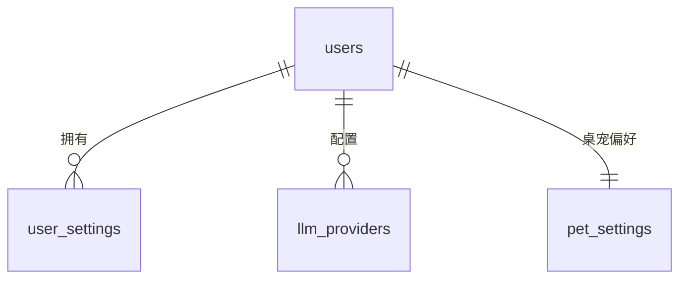
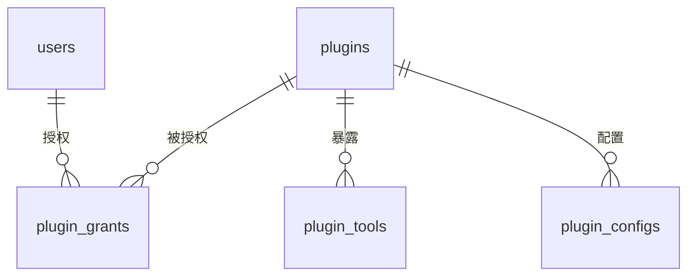
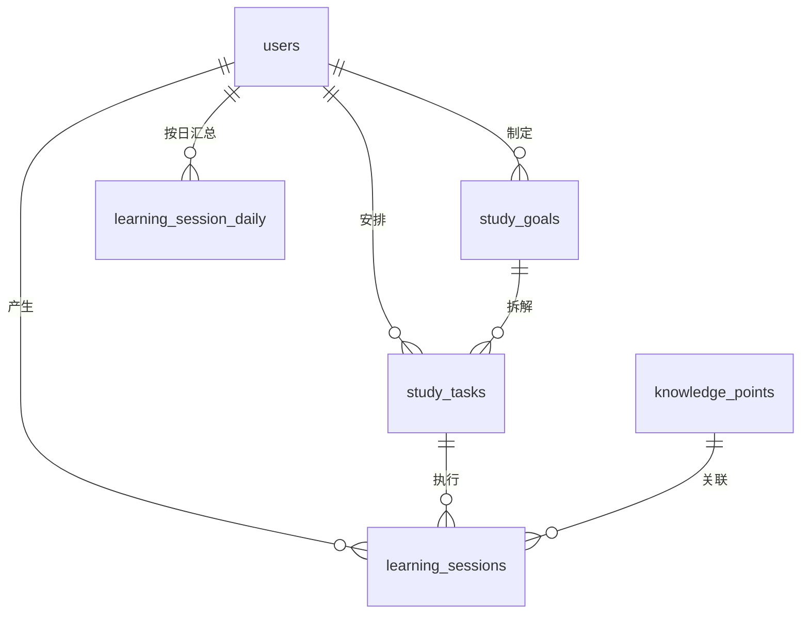
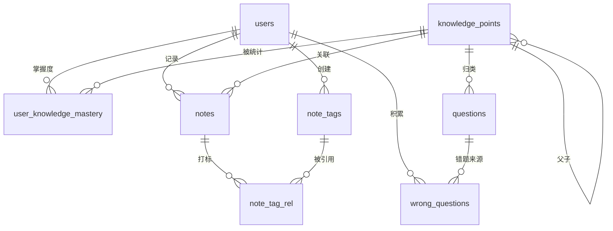
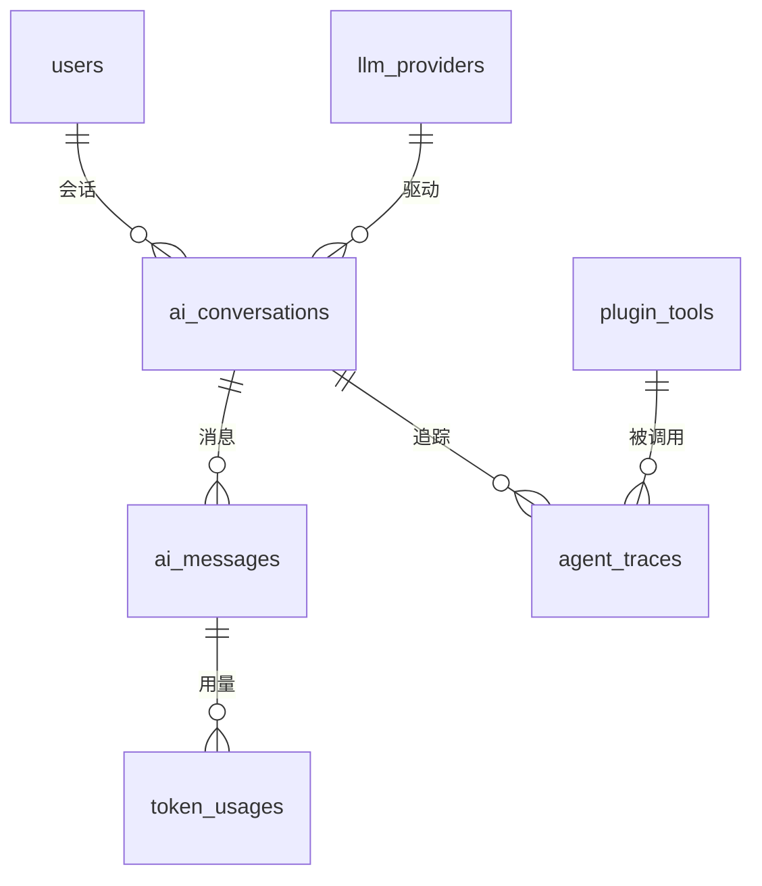
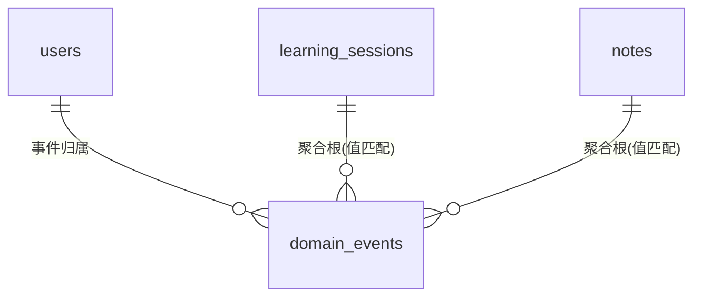

# 数据库设计（database.md）

> 技术前提：**MySQL 8.0**，引擎 **InnoDB**，字符集 **utf8mb4**，排序规则 **utf8mb4_0900_ai_ci**。
> 定位：单用户本地运行优先，但所有用户相关表**保留 `user_id` 列**，为未来多用户/服务化留余地。
> 产品定位与约束见 `CLAUDE.md`；阶段划分见 `docs/roadmap.md`；AI 能力分级见 `docs/ai-levels.md`；
> 角色状态与桌宠交互见 `docs/character-spec.md`；本文件的决策登记见 `docs/dev-log.md`。
>
> 本文件只负责数据层，不重复上述文档内容。

---

## 1. 设计原则

### 1.1 命名规范

| 对象 | 规范 | 示例 |
|---|---|---|
| 表名 | `snake_case` + **复数** | `users`、`learning_sessions`、`ai_messages` |
| 字段 | `snake_case` 单数 | `user_id`、`started_at`、`duration_seconds` |
| 主键 | 统一 `id` | `id BIGINT NOT NULL AUTO_INCREMENT` |
| 外键列 | `<单数表名>_id` | `session_id`、`knowledge_point_id` |
| 布尔 | `is_` / `has_` 前缀 + `TINYINT(1)` | `is_leaf`、`is_correct`、`is_enabled` |
| 时间点（**瞬时**） | `_at` 后缀，`DATETIME(3)` | `started_at`、`created_at` |
| 时间点（**毫秒时间戳**） | `_ts` 后缀，`BIGINT` | `ts`、`started_ts`、`expires_ts` |
| 业务日期 | `_date` 后缀，`DATE` | `stat_date`、`last_study_date` |
| 时长 | `_seconds` 后缀，`INT` | `duration_seconds`、`focused_seconds` |
| 计数 | `_count` 后缀，`INT` | `error_count`、`message_count` |
| 索引 | `idx_<表>_<列缩写>` / `uk_<表>_<列>` | `idx_ls_user_started`、`uk_users_username` |
| 外键约束 | `fk_<子表>_<父表>` | `fk_notes_users` |

**不使用 MySQL `ENUM` 类型，统一 `VARCHAR` + `CHECK` 约束 + Java 枚举**，理由见 1.7。

### 1.2 主键策略：`BIGINT AUTO_INCREMENT`（推荐，有符号）

| 方案 | 结论 |
|---|---|
| **自增 BIGINT** | ✅ **采用**。InnoDB 聚簇索引按主键物理有序，单调递增插入不产生页分裂；索引体积小（8 字节），二级索引只带主键；单机本地无分布式 ID 需求 |
| 雪花 ID | ❌ 暂不采用。单机单实例用不上，反而引入时钟回拨、workerId 分配问题；若未来服务化再切，届时用"逻辑主键 + 自增物理键"双列方案迁移 |
| UUID / ULID | ❌ 不用作主键。36 字节随机值导致聚簇索引随机写入、页分裂、二级索引膨胀 |

**原则：主键只做技术标识，不做业务标识。** 跨端、可导出、可幂等的业务标识另设独立列：
`users.username`、`plugins.plugin_key`、`ai_conversations.conversation_uid`、
`learning_sessions.client_session_uid`、`domain_events.event_uid`、`domain_events.idempotency_key`。
后续若要对外暴露 ID，用这些业务键，不暴露自增 `id`（避免枚举与迁移耦合）。

**为什么用有符号 `BIGINT` 而非 `BIGINT UNSIGNED`**：有符号上限 9.2e18，本地单用户与本项目
任何可预见的场景都用不完；而 `BIGINT UNSIGNED` 在 JDBC / JPA 中会映射为 `BigInteger`，
与 Java 侧 `Long` 之间需要额外转换，容易在 SQL 条件与 JSON 序列化上踩坑。
**本文件所有 DDL 统一使用有符号 `BIGINT`。**

### 1.3 审计字段与软删除

- 所有**业务实体表**必须具备：`created_at DATETIME(3) NOT NULL DEFAULT CURRENT_TIMESTAMP(3)`、
  `updated_at DATETIME(3) NOT NULL DEFAULT CURRENT_TIMESTAMP(3) ON UPDATE CURRENT_TIMESTAMP(3)`。
- 需要回收站的表增加 `deleted_at DATETIME(3) NULL`，**NULL 表示未删除**。
- **例外**：只追加的日志/流水表（`ai_messages`、`agent_traces`、`token_usages`、
  `domain_events`、`_rel` 关联表、预聚合表）不加 `updated_at`/`deleted_at`。
- 软删除的**代价**：唯一索引会与已删除行冲突。处理策略按表选择：
  - `users` / `plugins` / `knowledge_points` / `questions`：唯一键中带 `deleted_at`，
    用 `deleted_at` 的常量默认值参与唯一性（MySQL 下 NULL 不参与唯一比较，故改为
    `deleted_at DATETIME(3) NOT NULL DEFAULT '1970-01-01 00:00:00.000'` 更严谨）。
    **本项目统一采用这一写法**：`deleted_at` 为 `NOT NULL DEFAULT '1970-01-01 00:00:00.000'`，
    删除时写入当前时间，活跃行为默认值。
  - 其代价是业务查询必须带 `deleted_at = '1970-01-01 00:00:00.000'` 条件。
    为降低漏写风险，**所有读取走 Repository 层统一封装**（MyBatis-Plus 逻辑删除 / JPA `@Where`），
    禁止在 Service 里手写裸 SQL 查这些表。

### 1.4 时区与时间类型

| 用途 | 类型 | 理由 |
|---|---|---|
| 审计时间、业务瞬时 | `DATETIME(3)` | **不用 `TIMESTAMP`**：`TIMESTAMP` 受 `time_zone` 影响会在读写时隐式转换，且有 2038 上限；`DATETIME` 存"字面时间"，服务端统一按 UTC 写入 |
| 业务日期（按天聚合、连续学习） | `DATE` | 不受时区/夏令时影响，`UNIQUE(user_id, stat_date)` 天然去重 |
| 与前端/Java `Instant` 对齐的时间戳 | `BIGINT`（epoch millis） | 插件 UI 与桌宠动画需要毫秒精度且免时区解析 |
| **统一约定** | 数据库会话 `time_zone = '+00:00'`，所有 `DATETIME` 按 **UTC** 写入，展示时在前端本地化 | 一条铁律，避免"库里时间是啥"的争论 |

### 1.5 数值精度

| 语义 | 类型 | 理由 |
|---|---|---|
| 时长（原始） | `INT`（秒） | 番茄钟以秒为最小单位，`INT` 足够；禁止用 `FLOAT`/`DOUBLE` |
| 时长（聚合展示） | `DECIMAL(10,2)`（小时） | 仅出现在预聚合表，避免前端反复除 3600 |
| Token 数 | `INT` | 单次调用不可能溢出 |
| 费用 | `DECIMAL(12,6)` | LLM 单价极小（如 $0.00014/1K tokens），6 位小数足够且无浮点误差；禁止 `DOUBLE` |
| 桌宠坐标 | `DECIMAL(12,2)` | 多屏场景坐标可能为负、可能超 10000（虚拟桌面拼接），`SMALLINT` 不够 |
| 掌握度 | `TINYINT`（0-100） | 百分点整数，见 7.2 的算法落点 |

### 1.6 事件与状态枚举的两种存法

**统一采用 `VARCHAR` 大写枚举串 + `CHECK` 约束**（如 `status VARCHAR(16)` 存 `'RUNNING'`）：

| 对比 | `VARCHAR` + CHECK | `TINYINT` + 字典表 |
|---|---|---|
| 直接连库可读性 | ✅ `status='RUNNING'` 一眼看懂 | ❌ 需 join 字典表 |
| 写入可读性 | ✅ 日志、`EXPLAIN`、手工 SQL 都友好 | ❌ 需要反复对照 |
| 存储/索引体积 | 略大（最多几十字节） | 最小 |
| 新增枚举值 | 改 CHECK 需 DDL（本项目枚举稳定，可接受） | 无需 DDL |
| 排序 | 字典序，非业务序 | 可控 |

**决策**：本项目**唯一审计人是你自己**，且你明确要求"直接连库查看数据"，因此统一走
`VARCHAR` + `CHECK`。代价是改枚举值需要一条 `ALTER TABLE ... DROP CHECK / ADD CHECK`，
用 Flyway 迁移管理即可（见第 9 节）。**不使用字典表**，避免为几十个枚举引入 join。

### 1.7 其他约定

- **禁止物理外键约束（FOREIGN KEY）**：本项目用逻辑外键（`xxx_id` 列 + 应用层保证），
  避免插件写入/批量导入时的锁竞争与级联删除风险，也便于未来分库。DDL 中只建索引。
- **所有表所有字段必须写 `COMMENT`**，包括 `id` 与审计字段。
- 单列注释用行内 `COMMENT '...'`；表注释用 `COMMENT='...'`。
- 每张表统一 `ENGINE=InnoDB DEFAULT CHARSET=utf8mb4 COLLATE=utf8mb4_0900_ai_ci`。

### 1.8 跨端 Schema 契约（Java / 前端 / SQL 必须一致）

以下常量**不是实现细节**，而是三端共享的契约。任何一处改动都必须同步本节，
并登记到 `docs/dev-log.md`。代码中必须引用成对常量，**禁止散落字面量**。

| 契约项 | 值 | 说明 |
|---|---|---|
| 本地默认用户 ID | `1L` | MVP 无用户系统，固定一条 `users` 记录（id=1, username=`local`），见 `V4__seed_local_user.sql`。Java 侧常量 `LocalUser.ID`；前端不做用户切换 |
| 软删除哨兵值 | `'1970-01-01 00:00:00.000'` | `deleted_at` 为 `NOT NULL DEFAULT` 该值表示**未删除**（原因见 1.3）。Java 侧常量 `SoftDelete.NOT_DELETED`，禁止在 Service 里手写该字符串 |
| 数据库会话时区 | `+00:00`（UTC） | 连接串已带 `serverTimezone=UTC`；所有 `DATETIME` 按 UTC 写入，展示时前端本地化（原因见 1.4） |
| 逻辑外键 | 无 `FOREIGN KEY` 约束 | `xxx_id` 为逻辑外键，由应用层保证（原因见 1.7）。**跨表一致性检查由 Service 承担，不能被 DB 兜底** |
| 主键类型 | 有符号 `BIGINT AUTO_INCREMENT` | 见 1.2；Java 侧统一 `Long` |
| 字符集 / 排序规则 | `utf8mb4` / `utf8mb4_0900_ai_ci` | 建库与每张表统一，见 1.7 |

**敏感数据契约**：

- `llm_providers.api_key_cipher` 与 `user_settings.setting_value`（`is_secret=1` 时）存
  **AES-256-GCM 密文**，密钥来自操作系统密钥链（Windows DPAPI / Credential Manager）。
- `api_key` **禁止**出现在：日志、`domain_events.payload`、`agent_traces`、接口响应。
  接口只回显 `api_key_hint`（尾 4 位）。依据 `CLAUDE.md` 第 2.7 条可追溯性 ≠ 泄露密钥。

**迁移脚本与本文的关系**（见 `docs/dev-log.md` D5）：

- `db/migration/*.sql` 是**唯一可执行真源**，由 `tools/extract-ddl.ps1` 从本文抽取生成。
- 修改表结构的正确顺序：**改本文 → 重跑 `tools/extract-ddl.ps1` → 用 MySQL 实际执行验证**。
- `V7__vector.sql` 属 Phase 7，**本期不执行**。

---

## 2. 分模块表设计

共 **22 张表**，按模块划分：

| 模块 | 表 |
|---|---|
| user | `users`、`user_settings`、`llm_providers`、`pet_settings` |
| plugin | `plugins`、`plugin_tools`、`plugin_configs`、`plugin_grants` |
| learning | `study_goals`、`study_tasks`、`learning_sessions`、`learning_session_daily` |
| knowledge | `knowledge_points`、`user_knowledge_mastery`、`notes`、`note_tags`、`note_tag_rel`、`questions`、`wrong_questions` |
| ai | `ai_conversations`、`ai_messages`、`token_usages`、`agent_traces` |
| event | `domain_events` |

### 2.1 user 模块

#### 2.1.1 users —— 用户

```sql
CREATE TABLE `users` (
  `id`            BIGINT       NOT NULL AUTO_INCREMENT COMMENT '主键',
  `username`      VARCHAR(64)  NOT NULL                COMMENT '登录名，本地单用户时固定为 local',
  `display_name`  VARCHAR(64)  NOT NULL DEFAULT '学习者' COMMENT '显示名，用于桌宠称呼与 AI 提示',
  `avatar_path`   VARCHAR(255)     NULL                COMMENT '头像相对路径，NULL 表示使用大肥鱼默认形象',
  `status`        VARCHAR(16)  NOT NULL DEFAULT 'ACTIVE' COMMENT '状态：ACTIVE/DISABLED',
  `last_login_at` DATETIME(3)      NULL                COMMENT '最近登录时间(UTC)',
  `created_at`    DATETIME(3)  NOT NULL DEFAULT CURRENT_TIMESTAMP(3) COMMENT '创建时间(UTC)',
  `updated_at`    DATETIME(3)  NOT NULL DEFAULT CURRENT_TIMESTAMP(3) ON UPDATE CURRENT_TIMESTAMP(3) COMMENT '更新时间(UTC)',
  `deleted_at`    DATETIME(3)  NOT NULL DEFAULT '1970-01-01 00:00:00.000' COMMENT '软删除时间(UTC)，默认值表示未删除',
  PRIMARY KEY (`id`),
  UNIQUE KEY `uk_users_username` (`username`, `deleted_at`),
  CONSTRAINT `ck_users_status` CHECK (`status` IN ('ACTIVE','DISABLED'))
) ENGINE=InnoDB DEFAULT CHARSET=utf8mb4 COLLATE=utf8mb4_0900_ai_ci COMMENT='用户表';
```

#### 2.1.2 user_settings —— 用户级设置（含 LLM API Key）

> **加密考虑**：`api_key_cipher` 存 **AES-256-GCM 密文**（Base64），**绝不明文**。
> 密钥来源为操作系统密钥链（Windows DPAPI / Credential Manager），不落库、不进 Git。
> 数据库里只保留 `api_key_hint`（后 4 位，供 UI 回显辨识）与 `api_key_cipher`。
> 导出备份时仅导出密文，换机后需重新录入 Key。**禁止把 Key 写进日志、事件表、Agent Trace。**

```sql
CREATE TABLE `user_settings` (
  `id`             BIGINT       NOT NULL AUTO_INCREMENT COMMENT '主键',
  `user_id`        BIGINT       NOT NULL                COMMENT '所属用户ID，逻辑外键 users.id',
  `setting_key`    VARCHAR(64)  NOT NULL                COMMENT '设置项键，如 theme/language/active_provider_id',
  `setting_value`  TEXT             NULL                COMMENT '设置项值(JSON 或纯文本)，敏感值必须先加密',
  `value_type`     VARCHAR(16)  NOT NULL DEFAULT 'STRING' COMMENT '值类型：STRING/INT/BOOL/JSON',
  `is_secret`      TINYINT(1)   NOT NULL DEFAULT 0      COMMENT '是否密文：1=需解密后使用',
  `created_at`     DATETIME(3)  NOT NULL DEFAULT CURRENT_TIMESTAMP(3) COMMENT '创建时间(UTC)',
  `updated_at`     DATETIME(3)  NOT NULL DEFAULT CURRENT_TIMESTAMP(3) ON UPDATE CURRENT_TIMESTAMP(3) COMMENT '更新时间(UTC)',
  PRIMARY KEY (`id`),
  UNIQUE KEY `uk_user_settings_user_key` (`user_id`, `setting_key`),
  CONSTRAINT `ck_user_settings_value_type` CHECK (`value_type` IN ('STRING','INT','BOOL','JSON'))
) ENGINE=InnoDB DEFAULT CHARSET=utf8mb4 COLLATE=utf8mb4_0900_ai_ci COMMENT='用户级键值设置表';
```

#### 2.1.3 llm_providers —— LLM 供应商与 API 配置

> **与 `user_settings` 的分工**：零散开关放 `user_settings`；**LLM 接入配置单独成表**，
> 因为它是多行结构化实体（多家供应商、多家模型、可启停、可测连通性），塞进 K-V 会变成 JSON 炼狱。

```sql
CREATE TABLE `llm_providers` (
  `id`                BIGINT        NOT NULL AUTO_INCREMENT COMMENT '主键',
  `user_id`           BIGINT        NOT NULL                COMMENT '所属用户ID，逻辑外键 users.id',
  `provider_code`     VARCHAR(64)   NOT NULL                COMMENT '供应商标识：deepseek/openai/ollama/azure-openai 等',
  `display_name`      VARCHAR(64)   NOT NULL                COMMENT '展示名，如 DeepSeek 官方',
  `base_url`          VARCHAR(255)      NULL                COMMENT 'API Base URL，NULL 表示用 SDK 默认',
  `default_model`     VARCHAR(64)       NULL                COMMENT '默认模型名，如 deepseek-chat',
  `api_key_cipher`    VARBINARY(512)    NULL                COMMENT 'API Key 的 AES-256-GCM 密文，禁止明文',
  `api_key_hint`      VARCHAR(16)       NULL                COMMENT 'Key 尾部提示(如 sk-***abcd)，仅用于 UI 回显',
  `is_enabled`        TINYINT(1)    NOT NULL DEFAULT 1      COMMENT '是否启用：1=启用，0=停用',
  `is_default`        TINYINT(1)    NOT NULL DEFAULT 0      COMMENT '是否默认供应商：1=默认，同一用户最多一个',
  `temperature`       DECIMAL(3,2)  NOT NULL DEFAULT 0.70   COMMENT '默认温度参数',
  `max_tokens`        INT               NULL                COMMENT '默认最大输出 token，NULL 表示由模型决定',
  `timeout_seconds`   INT           NOT NULL DEFAULT 60     COMMENT '请求超时秒数',
  `last_tested_at`    DATETIME(3)       NULL                COMMENT '最近一次连通性测试时间(UTC)',
  `last_test_result`  VARCHAR(255)      NULL                COMMENT '最近一次测试结果摘要(不含敏感信息)',
  `created_at`        DATETIME(3)   NOT NULL DEFAULT CURRENT_TIMESTAMP(3) COMMENT '创建时间(UTC)',
  `updated_at`        DATETIME(3)   NOT NULL DEFAULT CURRENT_TIMESTAMP(3) ON UPDATE CURRENT_TIMESTAMP(3) COMMENT '更新时间(UTC)',
  `deleted_at`        DATETIME(3)   NOT NULL DEFAULT '1970-01-01 00:00:00.000' COMMENT '软删除时间(UTC)，默认值表示未删除',
  PRIMARY KEY (`id`),
  UNIQUE KEY `uk_llm_providers_user_code` (`user_id`, `provider_code`, `deleted_at`),
  KEY `idx_llm_providers_user_enabled` (`user_id`, `is_enabled`)
) ENGINE=InnoDB DEFAULT CHARSET=utf8mb4 COLLATE=utf8mb4_0900_ai_ci COMMENT='LLM 供应商与 API 配置表';
```

#### 2.1.4 pet_settings —— 桌宠偏好设置

> 字段与 `docs/character-spec.md` 的状态标识一一对应（`idle`/`blink`/`sleep`/...），
> 本表只存"用户偏好"，不存动画资源定义。

```sql
CREATE TABLE `pet_settings` (
  `id`                   BIGINT       NOT NULL AUTO_INCREMENT COMMENT '主键',
  `user_id`              BIGINT       NOT NULL                COMMENT '所属用户ID，逻辑外键 users.id',
  `window_x`             DECIMAL(12,2) NOT NULL DEFAULT 0     COMMENT '桌宠窗口 X 坐标(虚拟桌面像素)',
  `window_y`             DECIMAL(12,2) NOT NULL DEFAULT 0     COMMENT '桌宠窗口 Y 坐标(虚拟桌面像素)',
  `window_scale`         DECIMAL(4,3) NOT NULL DEFAULT 1.000  COMMENT '缩放比例，如 1.000 / 0.750',
  `always_on_top`        TINYINT(1)   NOT NULL DEFAULT 1      COMMENT '是否窗口置顶：1=置顶',
  `click_through`        TINYINT(1)   NOT NULL DEFAULT 0      COMMENT '是否鼠标穿透：1=穿透',
  `pet_size`             VARCHAR(16)  NOT NULL DEFAULT 'MEDIUM' COMMENT '显示尺寸档：SMALL/MEDIUM/LARGE',
  `opacity`              DECIMAL(4,3) NOT NULL DEFAULT 1.000  COMMENT '整体不透明度 0.000-1.000',
  `sound_enabled`        TINYINT(1)   NOT NULL DEFAULT 1      COMMENT '是否开启音效',
  `animation_enabled`    TINYINT(1)   NOT NULL DEFAULT 1      COMMENT '是否开启动画',
  `animation_fps`        TINYINT      NOT NULL DEFAULT 30     COMMENT '动画帧率上限',
  `idle_sleep_seconds`   INT          NOT NULL DEFAULT 600    COMMENT '无操作多少秒后进入睡眠状态(状态 sleep)',
  `proactive_enabled`    TINYINT(1)   NOT NULL DEFAULT 0      COMMENT '是否开启主动提醒，默认关闭(少打扰原则)',
  `proactive_min_interval_seconds` INT NOT NULL DEFAULT 3600  COMMENT '主动提醒最小间隔秒数，防止频繁打扰',
  `quiet_hours_start`    TIME             NULL                COMMENT '免打扰开始时间(本地时间)，NULL 表示不限制',
  `quiet_hours_end`      TIME             NULL                COMMENT '免打扰结束时间(本地时间)，NULL 表示不限制',
  `created_at`           DATETIME(3)  NOT NULL DEFAULT CURRENT_TIMESTAMP(3) COMMENT '创建时间(UTC)',
  `updated_at`           DATETIME(3)  NOT NULL DEFAULT CURRENT_TIMESTAMP(3) ON UPDATE CURRENT_TIMESTAMP(3) COMMENT '更新时间(UTC)',
  PRIMARY KEY (`id`),
  UNIQUE KEY `uk_pet_settings_user` (`user_id`),
  CONSTRAINT `ck_pet_settings_pet_size` CHECK (`pet_size` IN ('SMALL','MEDIUM','LARGE')),
  CONSTRAINT `ck_pet_settings_opacity` CHECK (`opacity` >= 0 AND `opacity` <= 1)
) ENGINE=InnoDB DEFAULT CHARSET=utf8mb4 COLLATE=utf8mb4_0900_ai_ci COMMENT='桌宠偏好设置表';
```

### 2.2 plugin 模块

#### 2.2.1 plugins —— 插件注册表

> 插件元数据字段与 `CLAUDE.md` 第 4 节要求一一对应：名称/版本/作者/描述/依赖/权限/配置。

```sql
CREATE TABLE `plugins` (
  `id`             BIGINT        NOT NULL AUTO_INCREMENT COMMENT '主键',
  `plugin_key`     VARCHAR(64)   NOT NULL                COMMENT '插件唯一标识，如 pomodoro/note/wrong-question',
  `name`           VARCHAR(64)   NOT NULL                COMMENT '插件名称(展示用)',
  `version`        VARCHAR(32)   NOT NULL                COMMENT '插件版本，语义化版本如 1.0.0',
  `author`         VARCHAR(64)       NULL                COMMENT '插件作者',
  `description`    VARCHAR(500)      NULL                COMMENT '插件描述',
  `entry_point`    VARCHAR(255)      NULL                COMMENT '入口标识，如 Spring Bean 名或前端入口路径',
  `capabilities`   JSON              NULL                COMMENT '能力声明 JSON 数组，如 ["timer","stats"]',
  `dependencies`   JSON              NULL                COMMENT '依赖的其他插件 key 数组',
  `required_permissions` JSON         NULL               COMMENT '插件声明的必需权限 JSON 数组',
  `status`         VARCHAR(16)   NOT NULL DEFAULT 'DISABLED' COMMENT '状态：ENABLED/DISABLED/ERROR',
  `installed_at`   DATETIME(3)   NOT NULL DEFAULT CURRENT_TIMESTAMP(3) COMMENT '安装/注册时间(UTC)',
  `last_loaded_at` DATETIME(3)       NULL                COMMENT '最近一次加载成功时间(UTC)',
  `load_error`     VARCHAR(500)      NULL                COMMENT '最近一次加载失败原因，成功时置 NULL',
  `created_at`     DATETIME(3)   NOT NULL DEFAULT CURRENT_TIMESTAMP(3) COMMENT '创建时间(UTC)',
  `updated_at`     DATETIME(3)   NOT NULL DEFAULT CURRENT_TIMESTAMP(3) ON UPDATE CURRENT_TIMESTAMP(3) COMMENT '更新时间(UTC)',
  `deleted_at`     DATETIME(3)   NOT NULL DEFAULT '1970-01-01 00:00:00.000' COMMENT '软删除时间(UTC)，默认值表示未删除',
  PRIMARY KEY (`id`),
  UNIQUE KEY `uk_plugins_key_version` (`plugin_key`, `version`, `deleted_at`),
  KEY `idx_plugins_status` (`status`)
) ENGINE=InnoDB DEFAULT CHARSET=utf8mb4 COLLATE=utf8mb4_0900_ai_ci COMMENT='插件注册表';
```

#### 2.2.2 plugin_tools —— 插件对外暴露的 Tool

> 这张表是 **Agent Tool Calling 的唯一权威来源**：Agent 只认这里注册的 tool，
> 保证 `CLAUDE.md` 的"Agent → Tool → Plugin → Service"链路可查、可审计、可开关。

```sql
CREATE TABLE `plugin_tools` (
  `id`                  BIGINT       NOT NULL AUTO_INCREMENT COMMENT '主键',
  `plugin_id`           BIGINT       NOT NULL                COMMENT '所属插件ID，逻辑外键 plugins.id',
  `tool_name`           VARCHAR(64)  NOT NULL                COMMENT '工具名(全局唯一)，如 getLearningStats',
  `display_name`        VARCHAR(64)      NULL                COMMENT '工具展示名',
  `description`         VARCHAR(500)     NULL                COMMENT '给 LLM 看的工具描述，直接影响调用准确率',
  `input_schema`        JSON             NULL                COMMENT '入参 JSON Schema',
  `output_schema`       JSON             NULL                COMMENT '出参 JSON Schema',
  `required_permission` VARCHAR(32)      NULL                COMMENT '调用所需权限码，NULL 表示无需额外权限',
  `is_enabled`          TINYINT(1)   NOT NULL DEFAULT 1      COMMENT '是否启用：1=启用',
  `created_at`          DATETIME(3)  NOT NULL DEFAULT CURRENT_TIMESTAMP(3) COMMENT '创建时间(UTC)',
  `updated_at`          DATETIME(3)  NOT NULL DEFAULT CURRENT_TIMESTAMP(3) ON UPDATE CURRENT_TIMESTAMP(3) COMMENT '更新时间(UTC)',
  PRIMARY KEY (`id`),
  UNIQUE KEY `uk_plugin_tools_name` (`tool_name`),
  KEY `idx_plugin_tools_plugin` (`plugin_id`, `is_enabled`)
) ENGINE=InnoDB DEFAULT CHARSET=utf8mb4 COLLATE=utf8mb4_0900_ai_ci COMMENT='插件对外暴露的 Tool 注册表';
```

#### 2.2.3 plugin_configs —— 插件配置项

```sql
CREATE TABLE `plugin_configs` (
  `id`             BIGINT       NOT NULL AUTO_INCREMENT COMMENT '主键',
  `plugin_id`      BIGINT       NOT NULL                COMMENT '所属插件ID，逻辑外键 plugins.id',
  `user_id`        BIGINT       NOT NULL                COMMENT '生效用户ID，逻辑外键 users.id(为多用户留余地)',
  `config_key`     VARCHAR(64)  NOT NULL                COMMENT '配置键，如 default_focus_minutes',
  `config_value`   TEXT             NULL                COMMENT '配置值(字符串化，复杂结构用 JSON)',
  `value_type`     VARCHAR(16)  NOT NULL DEFAULT 'STRING' COMMENT '值类型：STRING/INT/BOOL/JSON',
  `is_secret`      TINYINT(1)   NOT NULL DEFAULT 0      COMMENT '是否密文：1=需解密后使用',
  `created_at`     DATETIME(3)  NOT NULL DEFAULT CURRENT_TIMESTAMP(3) COMMENT '创建时间(UTC)',
  `updated_at`     DATETIME(3)  NOT NULL DEFAULT CURRENT_TIMESTAMP(3) ON UPDATE CURRENT_TIMESTAMP(3) COMMENT '更新时间(UTC)',
  PRIMARY KEY (`id`),
  UNIQUE KEY `uk_plugin_configs_scope_key` (`plugin_id`, `user_id`, `config_key`),
  CONSTRAINT `ck_plugin_configs_value_type` CHECK (`value_type` IN ('STRING','INT','BOOL','JSON'))
) ENGINE=InnoDB DEFAULT CHARSET=utf8mb4 COLLATE=utf8mb4_0900_ai_ci COMMENT='插件配置表';
```

#### 2.2.4 plugin_grants —— 插件权限授权记录

> 权限码取值见 `CLAUDE.md` 第 4 节：`READ/WRITE/NETWORK/FILE/SYSTEM/AI`。
> **高风险权限（FILE/SYSTEM/NETWORK）必须存在一条 `status='ACTIVE'` 的授权记录**，
> 应用启动加载插件时校验；无记录则拒绝加载并写 `plugins.load_error`。

```sql
CREATE TABLE `plugin_grants` (
  `id`              BIGINT       NOT NULL AUTO_INCREMENT COMMENT '主键',
  `plugin_id`       BIGINT       NOT NULL                COMMENT '插件ID，逻辑外键 plugins.id',
  `user_id`         BIGINT       NOT NULL                COMMENT '授权用户ID，逻辑外键 users.id',
  `permission_code` VARCHAR(32)  NOT NULL                COMMENT '权限码：READ/WRITE/NETWORK/FILE/SYSTEM/AI',
  `status`          VARCHAR(16)  NOT NULL DEFAULT 'ACTIVE' COMMENT '授权状态：ACTIVE/REVOKED/DENIED',
  `granted_by`      VARCHAR(16)  NOT NULL DEFAULT 'USER' COMMENT '授权来源：USER=用户手动确认/SYSTEM=默认授予',
  `granted_at`      DATETIME(3)  NOT NULL DEFAULT CURRENT_TIMESTAMP(3) COMMENT '授权时间(UTC)',
  `revoked_at`      DATETIME(3)      NULL                COMMENT '撤销时间(UTC)，NULL 表示未撤销',
  `created_at`      DATETIME(3)  NOT NULL DEFAULT CURRENT_TIMESTAMP(3) COMMENT '创建时间(UTC)',
  `updated_at`      DATETIME(3)  NOT NULL DEFAULT CURRENT_TIMESTAMP(3) ON UPDATE CURRENT_TIMESTAMP(3) COMMENT '更新时间(UTC)',
  PRIMARY KEY (`id`),
  UNIQUE KEY `uk_plugin_grants_scope_perm` (`plugin_id`, `user_id`, `permission_code`),
  KEY `idx_plugin_grants_user_status` (`user_id`, `status`),
  CONSTRAINT `ck_plugin_grants_permission` CHECK (`permission_code` IN ('READ','WRITE','NETWORK','FILE','SYSTEM','AI')),
  CONSTRAINT `ck_plugin_grants_status` CHECK (`status` IN ('ACTIVE','REVOKED','DENIED'))
) ENGINE=InnoDB DEFAULT CHARSET=utf8mb4 COLLATE=utf8mb4_0900_ai_ci COMMENT='插件权限授权记录表';
```

### 2.3 learning 模块

#### 2.3.1 study_goals —— 学习目标

```sql
CREATE TABLE `study_goals` (
  `id`               BIGINT       NOT NULL AUTO_INCREMENT COMMENT '主键',
  `user_id`          BIGINT       NOT NULL                COMMENT '所属用户ID，逻辑外键 users.id',
  `title`            VARCHAR(128) NOT NULL                COMMENT '目标标题，如 三个月内掌握 Redis 核心原理',
  `description`      VARCHAR(500)     NULL                COMMENT '目标描述',
  `goal_type`        VARCHAR(16)  NOT NULL DEFAULT 'LONG_TERM' COMMENT '目标类型：SHORT_TERM/LONG_TERM',
  `status`           VARCHAR(16)  NOT NULL DEFAULT 'ACTIVE' COMMENT '状态：ACTIVE/COMPLETED/ARCHIVED',
  `target_value`     INT              NULL                COMMENT '目标量化值，如 3600(秒) 或 30(天)',
  `current_value`    INT          NOT NULL DEFAULT 0      COMMENT '当前进度值，由学习事件更新',
  `unit`             VARCHAR(16)      NULL                COMMENT '量化单位：SECONDS/DAYS/COUNT',
  `start_date`       DATE             NULL                COMMENT '开始日期(本地业务日)',
  `due_date`         DATE             NULL                COMMENT '截止日期(本地业务日)',
  `completed_at`     DATETIME(3)      NULL                COMMENT '完成时间(UTC)',
  `created_at`       DATETIME(3)  NOT NULL DEFAULT CURRENT_TIMESTAMP(3) COMMENT '创建时间(UTC)',
  `updated_at`       DATETIME(3)  NOT NULL DEFAULT CURRENT_TIMESTAMP(3) ON UPDATE CURRENT_TIMESTAMP(3) COMMENT '更新时间(UTC)',
  `deleted_at`       DATETIME(3)  NOT NULL DEFAULT '1970-01-01 00:00:00.000' COMMENT '软删除时间(UTC)，默认值表示未删除',
  PRIMARY KEY (`id`),
  KEY `idx_study_goals_user_status` (`user_id`, `status`, `deleted_at`),
  KEY `idx_study_goals_user_due` (`user_id`, `due_date`),
  CONSTRAINT `ck_study_goals_type` CHECK (`goal_type` IN ('SHORT_TERM','LONG_TERM')),
  CONSTRAINT `ck_study_goals_status` CHECK (`status` IN ('ACTIVE','COMPLETED','ARCHIVED'))
) ENGINE=InnoDB DEFAULT CHARSET=utf8mb4 COLLATE=utf8mb4_0900_ai_ci COMMENT='学习目标表';
```

#### 2.3.2 study_tasks —— 学习任务

```sql
CREATE TABLE `study_tasks` (
  `id`                 BIGINT       NOT NULL AUTO_INCREMENT COMMENT '主键',
  `user_id`            BIGINT       NOT NULL                COMMENT '所属用户ID，逻辑外键 users.id',
  `goal_id`            BIGINT           NULL                COMMENT '所属目标ID，逻辑外键 study_goals.id，NULL 表示独立任务',
  `title`              VARCHAR(128) NOT NULL                COMMENT '任务标题',
  `subject`            VARCHAR(64)      NULL                COMMENT '学科/科目，如 Redis、MySQL',
  `status`             VARCHAR(16)  NOT NULL DEFAULT 'TODO' COMMENT '状态：TODO/DOING/DONE/CANCELLED',
  `priority`           TINYINT      NOT NULL DEFAULT 2      COMMENT '优先级：1=高 2=中 3=低',
  `plan_date`          DATE             NULL                COMMENT '计划执行日期(本地业务日)',
  `duration_plan_seconds` INT           NULL                COMMENT '计划时长(秒)',
  `duration_done_seconds` INT       NOT NULL DEFAULT 0      COMMENT '已完成时长(秒)，由学习会话结束事件累加',
  `sort_order`         INT          NOT NULL DEFAULT 0      COMMENT '同日期内排序序号',
  `completed_at`       DATETIME(3)      NULL                COMMENT '完成时间(UTC)',
  `created_at`         DATETIME(3)  NOT NULL DEFAULT CURRENT_TIMESTAMP(3) COMMENT '创建时间(UTC)',
  `updated_at`         DATETIME(3)  NOT NULL DEFAULT CURRENT_TIMESTAMP(3) ON UPDATE CURRENT_TIMESTAMP(3) COMMENT '更新时间(UTC)',
  `deleted_at`         DATETIME(3)  NOT NULL DEFAULT '1970-01-01 00:00:00.000' COMMENT '软删除时间(UTC)，默认值表示未删除',
  PRIMARY KEY (`id`),
  KEY `idx_study_tasks_user_status_plan` (`user_id`, `status`, `plan_date`, `deleted_at`),
  KEY `idx_study_tasks_goal` (`goal_id`),
  CONSTRAINT `ck_study_tasks_status` CHECK (`status` IN ('TODO','DOING','DONE','CANCELLED'))
) ENGINE=InnoDB DEFAULT CHARSET=utf8mb4 COLLATE=utf8mb4_0900_ai_ci COMMENT='学习任务表';
```

#### 2.3.3 learning_sessions —— 学习会话（番茄钟）

> **全库最核心的事实表**。一次"开始学习 → 结束学习"产生一行，是学习时长、
> 行为数据、AI 总结、统计预聚合的唯一数据源。

```sql
CREATE TABLE `learning_sessions` (
  `id`                    BIGINT       NOT NULL AUTO_INCREMENT COMMENT '主键',
  `client_session_uid`    CHAR(36)     NOT NULL                COMMENT '客户端生成的会话UUID，用于离线补传去重',
  `idempotency_key`       VARCHAR(64)  NOT NULL                COMMENT '幂等键，服务端唯一，重复写入被丢弃',
  `user_id`               BIGINT       NOT NULL                COMMENT '所属用户ID，逻辑外键 users.id',
  `plugin_key`            VARCHAR(64)  NOT NULL DEFAULT 'pomodoro' COMMENT '产生本次会话的插件 key',
  `task_id`               BIGINT           NULL                COMMENT '关联学习任务ID，逻辑外键 study_tasks.id',
  `knowledge_point_id`    BIGINT           NULL                COMMENT '关联知识点ID，逻辑外键 knowledge_points.id',
  `subject`               VARCHAR(64)      NULL                COMMENT '学科/主题，如 Redis',
  `session_type`          VARCHAR(16)  NOT NULL DEFAULT 'POMODORO' COMMENT '会话类型：POMODORO/FREE/REVIEW',
  `status`                VARCHAR(16)  NOT NULL DEFAULT 'RUNNING' COMMENT '状态：RUNNING/COMPLETED/ABORTED',
  `duration_seconds`      INT          NOT NULL DEFAULT 0      COMMENT '有效学习时长(秒)',
  `focused_seconds`       INT          NOT NULL DEFAULT 0      COMMENT '其中处于专注状态的时长(秒)',
  `paused_seconds`        INT          NOT NULL DEFAULT 0      COMMENT '暂停累计时长(秒)',
  `pause_count`           INT          NOT NULL DEFAULT 0      COMMENT '暂停次数',
  `interruption_count`    INT          NOT NULL DEFAULT 0      COMMENT '打断次数(切窗口/离开等)',
  `focus_score`           TINYINT          NULL                COMMENT '专注评分 0-100，由插件计算',
  `started_at`            DATETIME(3)  NOT NULL                COMMENT '开始时间(UTC)',
  `ended_at`              DATETIME(3)      NULL                COMMENT '结束时间(UTC)，RUNNING 时为 NULL',
  `started_ts`            BIGINT       NOT NULL                COMMENT '开始时间戳(epoch millis)，供桌宠动画对齐',
  `ended_ts`              BIGINT           NULL                COMMENT '结束时间戳(epoch millis)',
  `stat_date`             DATE         NOT NULL                COMMENT '归属业务日期(本地)，用于按天聚合，跨零点会话归开始日',
  `mood`                  VARCHAR(16)      NULL                COMMENT '学习后自评：GREAT/NORMAL/TIRED/BAD',
  `remark`                VARCHAR(500)     NULL                COMMENT '用户备注',
  `created_at`            DATETIME(3)  NOT NULL DEFAULT CURRENT_TIMESTAMP(3) COMMENT '创建时间(UTC)',
  `updated_at`            DATETIME(3)  NOT NULL DEFAULT CURRENT_TIMESTAMP(3) ON UPDATE CURRENT_TIMESTAMP(3) COMMENT '更新时间(UTC)',
  PRIMARY KEY (`id`),
  UNIQUE KEY `uk_ls_idempotency_key` (`idempotency_key`),
  UNIQUE KEY `uk_ls_client_uid` (`client_session_uid`),
  KEY `idx_ls_user_started` (`user_id`, `started_at`),
  KEY `idx_ls_user_statdate_status` (`user_id`, `stat_date`, `status`),
  KEY `idx_ls_user_subject` (`user_id`, `subject`),
  KEY `idx_ls_knowledge_point` (`knowledge_point_id`),
  KEY `idx_ls_task` (`task_id`),
  CONSTRAINT `ck_ls_session_type` CHECK (`session_type` IN ('POMODORO','FREE','REVIEW')),
  CONSTRAINT `ck_ls_status` CHECK (`status` IN ('RUNNING','COMPLETED','ABORTED'))
) ENGINE=InnoDB DEFAULT CHARSET=utf8mb4 COLLATE=utf8mb4_0900_ai_ci COMMENT='学习会话表(番茄钟)';
```

> `idempotency_key` 建议由客户端构造为 `"{user_id}:{client_session_uid}"`，
> 服务端在 `UNIQUE` 冲突时直接判定为重复上报（见第 6.3 节）。

#### 2.3.4 learning_session_daily —— 每日学习统计（预聚合快照）

> 允许重复计算覆盖写（幂等回补）。**不加软删除、不加 `updated_at` 以外的审计**，
> 因为它是可从 `learning_sessions` + `wrong_questions` + `notes` 完全重建的派生数据。

```sql
CREATE TABLE `learning_session_daily` (
  `id`                   BIGINT       NOT NULL AUTO_INCREMENT COMMENT '主键',
  `user_id`              BIGINT       NOT NULL                COMMENT '所属用户ID，逻辑外键 users.id',
  `stat_date`            DATE         NOT NULL                COMMENT '统计业务日期(本地)',
  `session_count`        INT          NOT NULL DEFAULT 0      COMMENT '会话次数',
  `total_seconds`        INT          NOT NULL DEFAULT 0      COMMENT '当日总学习时长(秒)',
  `focused_seconds`      INT          NOT NULL DEFAULT 0      COMMENT '当日专注时长(秒)',
  `pomodoro_count`       INT          NOT NULL DEFAULT 0      COMMENT '完成的番茄钟个数',
  `question_count`       INT          NOT NULL DEFAULT 0      COMMENT '当日答题数',
  `correct_count`        INT          NOT NULL DEFAULT 0      COMMENT '当日答对数',
  `wrong_count`          INT          NOT NULL DEFAULT 0      COMMENT '当日答错数',
  `note_count`           INT          NOT NULL DEFAULT 0      COMMENT '当日新建笔记数',
  `new_knowledge_count`  INT          NOT NULL DEFAULT 0      COMMENT '当日新学知识点数',
  `review_count`         INT          NOT NULL DEFAULT 0      COMMENT '当日复习次数',
  `total_hours`          DECIMAL(10,2) NOT NULL DEFAULT 0.00  COMMENT '当日总时长(小时)，展示用冗余',
  `first_started_at`     DATETIME(3)      NULL                COMMENT '当日首次开始学习时间(UTC)',
  `last_ended_at`        DATETIME(3)      NULL                COMMENT '当日最后一次结束学习时间(UTC)',
  `created_at`           DATETIME(3)  NOT NULL DEFAULT CURRENT_TIMESTAMP(3) COMMENT '创建时间(UTC)',
  `updated_at`           DATETIME(3)  NOT NULL DEFAULT CURRENT_TIMESTAMP(3) ON UPDATE CURRENT_TIMESTAMP(3) COMMENT '更新时间(UTC)',
  PRIMARY KEY (`id`),
  UNIQUE KEY `uk_lsd_user_date` (`user_id`, `stat_date`),
  KEY `idx_lsd_date` (`stat_date`)
) ENGINE=InnoDB DEFAULT CHARSET=utf8mb4 COLLATE=utf8mb4_0900_ai_ci COMMENT='每日学习统计预聚合表';
```

### 2.4 knowledge 模块

#### 2.4.1 knowledge_points —— 知识点（树形结构）

> **邻接表 vs 路径枚举的选择**：
>
> | 方案 | 优点 | 缺点 |
> |---|---|---|
> | 纯邻接表（仅 `parent_id`） | 写入简单、无冗余、移动子树 O(1) | 查"某节点全部子孙"需递归 CTE，深度大时慢 |
> | 纯路径枚举（仅 `path`） | 查子孙一条 `LIKE 'path%'` 即得 | 移动子树要批量改路径；路径长度受字段上限约束 |
> | **邻接表 + 物化路径（本项目采用）** | 写入简单，且按前缀即可快速取子树；`depth` 冗余便于按层级统计 | 需应用层维护 `path`/`depth` 一致性 |
>
> 采用**组合方案**：`parent_id` 是权威父子关系（邻接表），`path` 是从根到自身的
> `id` 路径（如 `/1/7/23/`），`depth` 是层级冗余。移动子树时同时更新三者，
> 包在一个事务里（见第 6.1 节）。MySQL 8 支持递归 CTE，**重建 `path` 的回补脚本**
> 也用它（见第 7.3 节）。

```sql
CREATE TABLE `knowledge_points` (
  `id`          BIGINT       NOT NULL AUTO_INCREMENT COMMENT '主键',
  `parent_id`   BIGINT           NULL                COMMENT '父知识点ID，NULL 表示根节点，逻辑外键 knowledge_points.id',
  `name`        VARCHAR(128) NOT NULL                COMMENT '知识点名称，如 缓存穿透',
  `code`        VARCHAR(64)      NULL                COMMENT '知识点编码(同一父节点下建议唯一)，便于插件引用',
  `subject`     VARCHAR(64)      NULL                COMMENT '所属学科，如 Redis/MySQL/Java',
  `path`        VARCHAR(255) NOT NULL DEFAULT '/'    COMMENT '从根到自身的ID路径，如 /1/7/23/，便于前缀查子树',
  `depth`       TINYINT      NOT NULL DEFAULT 0      COMMENT '层级深度，根节点为 0',
  `sort_order`  INT          NOT NULL DEFAULT 0      COMMENT '同级排序序号',
  `description` TEXT             NULL                COMMENT '知识点说明/定义',
  `source`      VARCHAR(16)  NOT NULL DEFAULT 'USER' COMMENT '来源：USER=手动/SYSTEM=预置/AI=模型生成/AI_CONFIRMED=AI建议且用户确认',
  `is_leaf`     TINYINT(1)   NOT NULL DEFAULT 1      COMMENT '是否叶子节点：1=叶子，便于只统计末级知识点',
  `created_at`  DATETIME(3)  NOT NULL DEFAULT CURRENT_TIMESTAMP(3) COMMENT '创建时间(UTC)',
  `updated_at`  DATETIME(3)  NOT NULL DEFAULT CURRENT_TIMESTAMP(3) ON UPDATE CURRENT_TIMESTAMP(3) COMMENT '更新时间(UTC)',
  `deleted_at`  DATETIME(3)  NOT NULL DEFAULT '1970-01-01 00:00:00.000' COMMENT '软删除时间(UTC)，默认值表示未删除',
  PRIMARY KEY (`id`),
  KEY `idx_kp_parent` (`parent_id`, `sort_order`),
  KEY `idx_kp_path` (`path`(191)),
  KEY `idx_kp_subject` (`subject`, `deleted_at`),
  KEY `idx_kp_code` (`code`),
  CONSTRAINT `ck_kp_source` CHECK (`source` IN ('USER','SYSTEM','AI','AI_CONFIRMED'))
) ENGINE=InnoDB DEFAULT CHARSET=utf8mb4 COLLATE=utf8mb4_0900_ai_ci COMMENT='知识点表(邻接表+物化路径)';
```

#### 2.4.2 user_knowledge_mastery —— 用户-知识点掌握度

> 每行代表"某用户对某知识点"的聚合状态。**这是"薄弱知识点"的唯一权威数据源。**
> `mastery_level` 由真实行为数据计算（错误率、复习间隔、最近表现），**不由 LLM 编造**
> （`CLAUDE.md` 约束 6）；LLM 只能在已有数值之上做解释与建议。

```sql
CREATE TABLE `user_knowledge_mastery` (
  `id`                   BIGINT       NOT NULL AUTO_INCREMENT COMMENT '主键',
  `user_id`              BIGINT       NOT NULL                COMMENT '所属用户ID，逻辑外键 users.id',
  `knowledge_point_id`   BIGINT       NOT NULL                COMMENT '知识点ID，逻辑外键 knowledge_points.id',
  `mastery_level`        TINYINT      NOT NULL DEFAULT 0      COMMENT '掌握程度 0-100，由行为规则计算',
  `mastery_stage`        VARCHAR(16)  NOT NULL DEFAULT 'NEW'  COMMENT '掌握阶段：NEW/LEARNING/FAMILIAR/MASTERED',
  `study_count`          INT          NOT NULL DEFAULT 0      COMMENT '学习次数',
  `total_seconds`        INT          NOT NULL DEFAULT 0      COMMENT '累计学习时长(秒)',
  `question_count`       INT          NOT NULL DEFAULT 0      COMMENT '累计答题数',
  `correct_count`        INT          NOT NULL DEFAULT 0      COMMENT '累计答对数',
  `wrong_count`          INT          NOT NULL DEFAULT 0      COMMENT '累计答错数',
  `correct_rate`         DECIMAL(5,4) NOT NULL DEFAULT 0.0000 COMMENT '正确率 0.0000-1.0000，冗余便于排序',
  `review_count`         INT          NOT NULL DEFAULT 0      COMMENT '复习次数',
  `last_studied_at`      DATETIME(3)      NULL                COMMENT '最近学习时间(UTC)',
  `last_reviewed_at`     DATETIME(3)      NULL                COMMENT '最近复习时间(UTC)',
  `next_review_date`     DATE             NULL                COMMENT '建议下次复习日期，由间隔重复算法给出',
  `is_weak`              TINYINT(1)   NOT NULL DEFAULT 0      COMMENT '是否薄弱：1=薄弱，由规则判定并冗余以便快速筛选',
  `version`              INT          NOT NULL DEFAULT 0      COMMENT '乐观锁版本号，并发更新掌握度时使用',
  `created_at`           DATETIME(3)  NOT NULL DEFAULT CURRENT_TIMESTAMP(3) COMMENT '创建时间(UTC)',
  `updated_at`           DATETIME(3)  NOT NULL DEFAULT CURRENT_TIMESTAMP(3) ON UPDATE CURRENT_TIMESTAMP(3) COMMENT '更新时间(UTC)',
  PRIMARY KEY (`id`),
  UNIQUE KEY `uk_ukm_user_kp` (`user_id`, `knowledge_point_id`),
  KEY `idx_ukm_user_weak` (`user_id`, `is_weak`, `mastery_level`),
  KEY `idx_ukm_user_review_date` (`user_id`, `next_review_date`),
  KEY `idx_ukm_user_last_studied` (`user_id`, `last_studied_at`),
  CONSTRAINT `ck_ukm_stage` CHECK (`mastery_stage` IN ('NEW','LEARNING','FAMILIAR','MASTERED')),
  CONSTRAINT `ck_ukm_mastery_level` CHECK (`mastery_level` >= 0 AND `mastery_level` <= 100),
  CONSTRAINT `ck_ukm_correct_rate` CHECK (`correct_rate` >= 0 AND `correct_rate` <= 1)
) ENGINE=InnoDB DEFAULT CHARSET=utf8mb4 COLLATE=utf8mb4_0900_ai_ci COMMENT='用户知识点掌握度表';
```

#### 2.4.3 notes —— 笔记

```sql
CREATE TABLE `notes` (
  `id`                 BIGINT       NOT NULL AUTO_INCREMENT COMMENT '主键',
  `user_id`            BIGINT       NOT NULL                COMMENT '所属用户ID，逻辑外键 users.id',
  `knowledge_point_id` BIGINT           NULL                COMMENT '关联知识点ID，逻辑外键 knowledge_points.id',
  `title`              VARCHAR(200) NOT NULL DEFAULT ''     COMMENT '笔记标题',
  `content_md`         MEDIUMTEXT       NULL                COMMENT '正文(Markdown 原文)',
  `content_plain`      MEDIUMTEXT       NULL                COMMENT '纯文本正文(去标记)，用于全文检索',
  `source`             VARCHAR(16)  NOT NULL DEFAULT 'USER' COMMENT '来源：USER=手写/AI=AI生成/AI_CONFIRMED=AI生成且用户确认',
  `source_session_id`  BIGINT           NULL                COMMENT '来源学习会话ID，逻辑外键 learning_sessions.id',
  `is_pinned`          TINYINT(1)   NOT NULL DEFAULT 0      COMMENT '是否置顶：1=置顶',
  `word_count`         INT          NOT NULL DEFAULT 0      COMMENT '字数统计',
  `created_at`         DATETIME(3)  NOT NULL DEFAULT CURRENT_TIMESTAMP(3) COMMENT '创建时间(UTC)',
  `updated_at`         DATETIME(3)  NOT NULL DEFAULT CURRENT_TIMESTAMP(3) ON UPDATE CURRENT_TIMESTAMP(3) COMMENT '更新时间(UTC)',
  `deleted_at`         DATETIME(3)  NOT NULL DEFAULT '1970-01-01 00:00:00.000' COMMENT '软删除时间(UTC)，默认值表示未删除',
  PRIMARY KEY (`id`),
  KEY `idx_notes_user_created` (`user_id`, `deleted_at`, `created_at`),
  KEY `idx_notes_knowledge_point` (`knowledge_point_id`),
  KEY `idx_notes_user_pinned` (`user_id`, `is_pinned`),
  FULLTEXT KEY `ft_notes_content` (`title`, `content_plain`) WITH PARSER ngram,
  CONSTRAINT `ck_notes_source` CHECK (`source` IN ('USER','AI','AI_CONFIRMED'))
) ENGINE=InnoDB DEFAULT CHARSET=utf8mb4 COLLATE=utf8mb4_0900_ai_ci COMMENT='笔记表';
```

> `FULLTEXT ... WITH PARSER ngram` 是中文全文检索的必需项（`ngram_token_size` 默认 2）。
> 若你的 MySQL 未启用 ngram 插件，此索引需单独迁移脚本，见第 9 节 `V9`。

#### 2.4.4 note_tags / note_tag_rel —— 标签与关联

```sql
CREATE TABLE `note_tags` (
  `id`         BIGINT       NOT NULL AUTO_INCREMENT COMMENT '主键',
  `user_id`    BIGINT       NOT NULL                COMMENT '所属用户ID，逻辑外键 users.id',
  `name`       VARCHAR(32)  NOT NULL                COMMENT '标签名，同一用户下唯一',
  `color`      VARCHAR(16)      NULL                COMMENT '标签颜色(十六进制)，如 #3B82F6',
  `sort_order` INT          NOT NULL DEFAULT 0      COMMENT '排序序号',
  `note_count` INT          NOT NULL DEFAULT 0      COMMENT '关联笔记数(冗余计数，便于展示)',
  `created_at` DATETIME(3)  NOT NULL DEFAULT CURRENT_TIMESTAMP(3) COMMENT '创建时间(UTC)',
  `updated_at` DATETIME(3)  NOT NULL DEFAULT CURRENT_TIMESTAMP(3) ON UPDATE CURRENT_TIMESTAMP(3) COMMENT '更新时间(UTC)',
  `deleted_at` DATETIME(3)  NOT NULL DEFAULT '1970-01-01 00:00:00.000' COMMENT '软删除时间(UTC)，默认值表示未删除',
  PRIMARY KEY (`id`),
  UNIQUE KEY `uk_note_tags_user_name` (`user_id`, `name`, `deleted_at`)
) ENGINE=InnoDB DEFAULT CHARSET=utf8mb4 COLLATE=utf8mb4_0900_ai_ci COMMENT='笔记标签表';

CREATE TABLE `note_tag_rel` (
  `id`         BIGINT      NOT NULL AUTO_INCREMENT COMMENT '主键',
  `note_id`    BIGINT      NOT NULL COMMENT '笔记ID，逻辑外键 notes.id',
  `tag_id`     BIGINT      NOT NULL COMMENT '标签ID，逻辑外键 note_tags.id',
  `created_at` DATETIME(3) NOT NULL DEFAULT CURRENT_TIMESTAMP(3) COMMENT '创建时间(UTC)',
  PRIMARY KEY (`id`),
  UNIQUE KEY `uk_ntr_note_tag` (`note_id`, `tag_id`),
  KEY `idx_ntr_tag` (`tag_id`)
) ENGINE=InnoDB DEFAULT CHARSET=utf8mb4 COLLATE=utf8mb4_0900_ai_ci COMMENT='笔记-标签关联表';
```

#### 2.4.5 questions —— 题目

> 题目本体设计为**用户私有内容为主、可共享**：`owner_user_id NULL` 表示系统/共享题库，
> 非 NULL 表示用户自建。为未来"插件市场共享题库"留余地。

```sql
CREATE TABLE `questions` (
  `id`                  BIGINT       NOT NULL AUTO_INCREMENT COMMENT '主键',
  `owner_user_id`       BIGINT           NULL                COMMENT '归属用户ID，NULL 表示系统/共享题目，逻辑外键 users.id',
  `knowledge_point_id`  BIGINT           NULL                COMMENT '主知识点ID，逻辑外键 knowledge_points.id',
  `question_type`       VARCHAR(16)  NOT NULL DEFAULT 'SINGLE' COMMENT '题型：SINGLE/MULTI/JUDGE/FILL/SHORT/CODE',
  `stem`                TEXT         NOT NULL                COMMENT '题干',
  `options_json`        JSON             NULL                COMMENT '选项 JSON，如 [{"key":"A","text":"..."}]',
  `answer`              TEXT             NULL                COMMENT '参考答案',
  `analysis`            TEXT             NULL                COMMENT '解析',
  `difficulty`          TINYINT      NOT NULL DEFAULT 3      COMMENT '难度 1-5，3 为中',
  `source`              VARCHAR(32)      NULL                COMMENT '题目来源，如 《Redis 设计与实现》/ 自编 / AI生成',
  `tags_json`           JSON             NULL                COMMENT '题目标签 JSON 数组，便于不分表检索',
  `is_enabled`          TINYINT(1)   NOT NULL DEFAULT 1      COMMENT '是否启用：1=启用，0=停用后不再出现在练习中',
  `created_at`          DATETIME(3)  NOT NULL DEFAULT CURRENT_TIMESTAMP(3) COMMENT '创建时间(UTC)',
  `updated_at`          DATETIME(3)  NOT NULL DEFAULT CURRENT_TIMESTAMP(3) ON UPDATE CURRENT_TIMESTAMP(3) COMMENT '更新时间(UTC)',
  `deleted_at`          DATETIME(3)  NOT NULL DEFAULT '1970-01-01 00:00:00.000' COMMENT '软删除时间(UTC)，默认值表示未删除',
  PRIMARY KEY (`id`),
  KEY `idx_questions_kp_enabled` (`knowledge_point_id`, `is_enabled`, `deleted_at`),
  KEY `idx_questions_owner` (`owner_user_id`, `deleted_at`),
  KEY `idx_questions_type_difficulty` (`question_type`, `difficulty`),
  CONSTRAINT `ck_questions_type` CHECK (`question_type` IN ('SINGLE','MULTI','JUDGE','FILL','SHORT','CODE')),
  CONSTRAINT `ck_questions_difficulty` CHECK (`difficulty` >= 1 AND `difficulty` <= 5)
) ENGINE=InnoDB DEFAULT CHARSET=utf8mb4 COLLATE=utf8mb4_0900_ai_ci COMMENT='题目表';
```

#### 2.4.6 wrong_questions —— 错题本

> **一次错误 = 一行，错误次数累加在行内**（而不是每次错误插一行）。
> 理由：错题本的查询模式是"我当前有哪些错题、哪些该重做"，看重状态而非流水；
> 每次作答的流水保留在 `agent_traces` / 未来 `question_attempts` 中。
> 唯一键 `(user_id, question_id)` 保证"同一题只有一条错题记录"。

```sql
CREATE TABLE `wrong_questions` (
  `id`                   BIGINT       NOT NULL AUTO_INCREMENT COMMENT '主键',
  `user_id`              BIGINT       NOT NULL                COMMENT '所属用户ID，逻辑外键 users.id',
  `question_id`          BIGINT       NOT NULL                COMMENT '题目ID，逻辑外键 questions.id',
  `knowledge_point_id`   BIGINT           NULL                COMMENT '冗余知识点ID，便于按知识点直查错题，逻辑外键 knowledge_points.id',
  `source_session_id`    BIGINT           NULL                COMMENT '最近一次出错所在学习会话ID，逻辑外键 learning_sessions.id',
  `source_plugin_key`    VARCHAR(64)      NULL                COMMENT '产生错题的插件 key，如 quiz',
  `wrong_count`          INT          NOT NULL DEFAULT 1      COMMENT '累计错误次数',
  `first_wrong_at`       DATETIME(3)  NOT NULL DEFAULT CURRENT_TIMESTAMP(3) COMMENT '首次出错时间(UTC)',
  `last_wrong_at`        DATETIME(3)  NOT NULL DEFAULT CURRENT_TIMESTAMP(3) COMMENT '最近出错时间(UTC)',
  `redo_count`           INT          NOT NULL DEFAULT 0      COMMENT '重做次数',
  `redo_correct_count`   INT          NOT NULL DEFAULT 0      COMMENT '重做正确次数',
  `status`               VARCHAR(16)  NOT NULL DEFAULT 'OPEN' COMMENT '状态：OPEN=待攻克/REVIEWING=复习中/MASTERED=已掌握/ARCHIVED=归档',
  `next_review_date`     DATE             NULL                COMMENT '建议下次重做日期',
  `mastered_at`          DATETIME(3)      NULL                COMMENT '攻克时间(UTC)',
  `my_answer`            TEXT             NULL                COMMENT '最近一次的错误作答',
  `error_reason`         VARCHAR(500)     NULL                COMMENT '错误原因/反思',
  `created_at`           DATETIME(3)  NOT NULL DEFAULT CURRENT_TIMESTAMP(3) COMMENT '创建时间(UTC)',
  `updated_at`           DATETIME(3)  NOT NULL DEFAULT CURRENT_TIMESTAMP(3) ON UPDATE CURRENT_TIMESTAMP(3) COMMENT '更新时间(UTC)',
  `deleted_at`           DATETIME(3)  NOT NULL DEFAULT '1970-01-01 00:00:00.000' COMMENT '软删除时间(UTC)，默认值表示未删除',
  PRIMARY KEY (`id`),
  UNIQUE KEY `uk_wq_user_question` (`user_id`, `question_id`),
  KEY `idx_wq_user_status_review` (`user_id`, `status`, `next_review_date`),
  KEY `idx_wq_kp` (`knowledge_point_id`, `user_id`),
  KEY `idx_wq_user_last_wrong` (`user_id`, `last_wrong_at`),
  CONSTRAINT `ck_wq_status` CHECK (`status` IN ('OPEN','REVIEWING','MASTERED','ARCHIVED'))
) ENGINE=InnoDB DEFAULT CHARSET=utf8mb4 COLLATE=utf8mb4_0900_ai_ci COMMENT='错题本表';
```

### 2.5 ai 模块

#### 2.5.1 ai_conversations —— AI 会话

```sql
CREATE TABLE `ai_conversations` (
  `id`               BIGINT       NOT NULL AUTO_INCREMENT COMMENT '主键',
  `conversation_uid` CHAR(36)     NOT NULL                COMMENT '会话UUID，对外暴露的业务标识',
  `user_id`          BIGINT       NOT NULL                COMMENT '所属用户ID，逻辑外键 users.id',
  `title`            VARCHAR(128) NOT NULL DEFAULT '新对话' COMMENT '会话标题，可由首条消息自动生成',
  `conversation_type` VARCHAR(16) NOT NULL DEFAULT 'CHAT'  COMMENT '类型：CHAT=普通对话/AGENT=Agent任务/REVIEW=学习复盘',
  `provider_id`      BIGINT           NULL                COMMENT '使用的 LLM 供应商ID，逻辑外键 llm_providers.id',
  `model`            VARCHAR(64)      NULL                COMMENT '使用的模型名，如 deepseek-chat',
  `system_prompt`    TEXT             NULL                COMMENT '系统提示词(不含 API Key)',
  `message_count`    INT          NOT NULL DEFAULT 0      COMMENT '消息条数(冗余计数)',
  `total_tokens`     INT          NOT NULL DEFAULT 0      COMMENT '累计消耗 token 数(冗余)',
  `is_pinned`        TINYINT(1)   NOT NULL DEFAULT 0      COMMENT '是否置顶',
  `status`           VARCHAR(16)  NOT NULL DEFAULT 'ACTIVE' COMMENT '状态：ACTIVE/ARCHIVED',
  `last_message_at`  DATETIME(3)      NULL                COMMENT '最近一条消息时间(UTC)，用于会话列表排序',
  `created_at`       DATETIME(3)  NOT NULL DEFAULT CURRENT_TIMESTAMP(3) COMMENT '创建时间(UTC)',
  `updated_at`       DATETIME(3)  NOT NULL DEFAULT CURRENT_TIMESTAMP(3) ON UPDATE CURRENT_TIMESTAMP(3) COMMENT '更新时间(UTC)',
  `deleted_at`       DATETIME(3)  NOT NULL DEFAULT '1970-01-01 00:00:00.000' COMMENT '软删除时间(UTC)，默认值表示未删除',
  PRIMARY KEY (`id`),
  UNIQUE KEY `uk_aic_uid` (`conversation_uid`),
  KEY `idx_aic_user_last_message` (`user_id`, `deleted_at`, `last_message_at`),
  KEY `idx_aic_user_status` (`user_id`, `status`),
  CONSTRAINT `ck_aic_type` CHECK (`conversation_type` IN ('CHAT','AGENT','REVIEW')),
  CONSTRAINT `ck_aic_status` CHECK (`status` IN ('ACTIVE','ARCHIVED'))
) ENGINE=InnoDB DEFAULT CHARSET=utf8mb4 COLLATE=utf8mb4_0900_ai_ci COMMENT='AI 会话表';
```

#### 2.5.2 ai_messages —— 消息

> **追加型时间序列表，不加 `updated_at`/`deleted_at`。**
> `content` 存 Markdown 原文；流式中断时状态为 `FAILED`，保留已生成片段便于排查。

```sql
CREATE TABLE `ai_messages` (
  `id`              BIGINT      NOT NULL AUTO_INCREMENT COMMENT '主键',
  `conversation_id` BIGINT      NOT NULL                COMMENT '所属会话ID，逻辑外键 ai_conversations.id',
  `user_id`         BIGINT      NOT NULL                COMMENT '所属用户ID，逻辑外键 users.id(冗余，避免分页时回表)',
  `seq`             INT         NOT NULL                COMMENT '会话内序号，从 1 开始递增',
  `role`            VARCHAR(16) NOT NULL                COMMENT '角色：SYSTEM/USER/ASSISTANT/TOOL',
  `content`         MEDIUMTEXT      NULL                COMMENT '消息内容(Markdown 或 TOOL 结果 JSON)',
  `content_type`    VARCHAR(16) NOT NULL DEFAULT 'TEXT' COMMENT '内容类型：TEXT/JSON/IMAGE_REF',
  `status`          VARCHAR(16) NOT NULL DEFAULT 'DONE' COMMENT '状态：PENDING/STREAMING/DONE/FAILED',
  `finish_reason`   VARCHAR(32)     NULL                COMMENT '结束原因：stop/length/tool_calls/content_filter',
  `tool_name`       VARCHAR(64)     NULL                COMMENT 'role=TOOL 时对应的工具名',
  `tool_call_id`    VARCHAR(64)     NULL                COMMENT 'LLM 返回的 tool_call id，用于回填结果',
  `prompt_tokens`   INT             NULL                COMMENT '本条请求的输入 token 数',
  `completion_tokens` INT           NULL                COMMENT '本条请求的输出 token 数',
  `latency_ms`      INT             NULL                COMMENT '端到端耗时(毫秒)',
  `created_at`      DATETIME(3) NOT NULL DEFAULT CURRENT_TIMESTAMP(3) COMMENT '创建时间(UTC)',
  PRIMARY KEY (`id`),
  UNIQUE KEY `uk_aim_conversation_seq` (`conversation_id`, `seq`),
  KEY `idx_aim_conversation_created` (`conversation_id`, `created_at`),
  KEY `idx_aim_user_created` (`user_id`, `created_at`),
  CONSTRAINT `ck_aim_role` CHECK (`role` IN ('SYSTEM','USER','ASSISTANT','TOOL')),
  CONSTRAINT `ck_aim_status` CHECK (`status` IN ('PENDING','STREAMING','DONE','FAILED'))
) ENGINE=InnoDB DEFAULT CHARSET=utf8mb4 COLLATE=utf8mb4_0900_ai_ci COMMENT='AI 消息表';
```

> **会话消息分页**用**游标分页**（`WHERE conversation_id=? AND seq < ?`），
> 而不是 `LIMIT offset, size`：前者恒定代价，后者深翻页要扫描并丢弃 offset 行。

#### 2.5.3 token_usages —— Token 用量统计

> 与 `ai_messages` 的分工：消息表存内容与单条 token 冗余；本表是**面向成本统计的事实表**，
> 每完成一次 LLM 调用写一行（含失败调用），支撑"每日/每月成本""按模型对比"类查询。
> `user_id` 为 NULL 表示系统级调用（如标题自动生成）。

```sql
CREATE TABLE `token_usages` (
  `id`                BIGINT        NOT NULL AUTO_INCREMENT COMMENT '主键',
  `user_id`           BIGINT            NULL                COMMENT '所属用户ID，NULL 表示系统级调用，逻辑外键 users.id',
  `conversation_id`   BIGINT            NULL                COMMENT '关联会话ID，逻辑外键 ai_conversations.id',
  `message_id`        BIGINT            NULL                COMMENT '关联消息ID，逻辑外键 ai_messages.id',
  `provider_code`     VARCHAR(64)   NOT NULL DEFAULT ''     COMMENT '供应商标识，如 deepseek',
  `model`             VARCHAR(64)   NOT NULL DEFAULT ''     COMMENT '模型名，如 deepseek-chat',
  `request_type`      VARCHAR(32)   NOT NULL DEFAULT 'CHAT' COMMENT '请求类型：CHAT/EMBEDDING/SUMMARY/TITLE/AGENT_STEP',
  `prompt_tokens`     INT           NOT NULL DEFAULT 0      COMMENT '输入 token 数',
  `completion_tokens` INT           NOT NULL DEFAULT 0      COMMENT '输出 token 数',
  `total_tokens`      INT           NOT NULL DEFAULT 0      COMMENT '总 token 数',
  `cached_tokens`     INT           NOT NULL DEFAULT 0      COMMENT '命中缓存 token 数(部分供应商支持)',
  `cost_amount`       DECIMAL(12,6) NOT NULL DEFAULT 0.000000 COMMENT '本次费用，单位由 currency 决定',
  `currency`          CHAR(3)       NOT NULL DEFAULT 'CNY'  COMMENT '费用币种',
  `latency_ms`        INT               NULL                COMMENT '调用耗时(毫秒)',
  `is_success`        TINYINT(1)    NOT NULL DEFAULT 1      COMMENT '是否成功：0=失败(仍计费需保留)',
  `error_code`        VARCHAR(64)       NULL                COMMENT '失败错误码',
  `stat_date`         DATE          NOT NULL                COMMENT '归属业务日期(本地)，用于按天聚合',
  `ts`                BIGINT        NOT NULL                COMMENT '调用发生时间戳(epoch millis)',
  `created_at`        DATETIME(3)   NOT NULL DEFAULT CURRENT_TIMESTAMP(3) COMMENT '创建时间(UTC)',
  PRIMARY KEY (`id`),
  KEY `idx_tu_user_date_model` (`user_id`, `stat_date`, `model`),
  KEY `idx_tu_conversation` (`conversation_id`),
  CONSTRAINT `ck_tu_request_type` CHECK (`request_type` IN ('CHAT','EMBEDDING','SUMMARY','TITLE','AGENT_STEP'))
) ENGINE=InnoDB DEFAULT CHARSET=utf8mb4 COLLATE=utf8mb4_0900_ai_ci COMMENT='LLM Token 用量与费用表';
```

#### 2.5.4 agent_traces —— Agent Trace（工具调用记录）

> 落实 `CLAUDE.md` 约束 7"AI 输出必须可追溯"与第 8 节 Agent 规范：
> **每个 Agent 步骤一行**，记录 Goal → 调了哪个 Tool → 入参 → 出参摘要 → 耗时 → 成败。
> **禁止写入 API Key、完整用户隐私原文**：入参出参超长时截断存摘要（`params_digest`/`result_digest`），
> 完整数据另存文件或后续对象存储。

```sql
CREATE TABLE `agent_traces` (
  `id`               BIGINT       NOT NULL AUTO_INCREMENT COMMENT '主键',
  `trace_uid`        CHAR(36)     NOT NULL                COMMENT '一次 Agent 运行的追踪UUID，同一次运行的多个步骤共享',
  `step_no`          INT          NOT NULL DEFAULT 1      COMMENT '步骤序号，从 1 开始',
  `user_id`          BIGINT           NULL                COMMENT '所属用户ID，NULL 表示系统级，逻辑外键 users.id',
  `conversation_id`  BIGINT           NULL                COMMENT '关联会话ID，逻辑外键 ai_conversations.id',
  `message_id`       BIGINT           NULL                COMMENT '触发本次步骤的消息ID，逻辑外键 ai_messages.id',
  `agent_name`       VARCHAR(64)  NOT NULL DEFAULT 'ChatAgent' COMMENT 'Agent 名称，如 LearningAgent',
  `action_type`      VARCHAR(16)  NOT NULL DEFAULT 'TOOL_CALL' COMMENT '动作类型：LLM_CALL/TOOL_CALL/RETRIEVAL/DECISION',
  `tool_name`        VARCHAR(64)      NULL                COMMENT '调用的工具名，如 getLearningStats',
  `plugin_key`       VARCHAR(64)      NULL                COMMENT '该工具所属插件 key',
  `params_digest`    TEXT             NULL                COMMENT '入参摘要(截断+脱敏)，禁止存 API Key',
  `result_digest`    TEXT             NULL                COMMENT '出参摘要(截断)，用于回溯结论依据',
  `result_status`    VARCHAR(16)  NOT NULL DEFAULT 'SUCCESS' COMMENT '结果状态：SUCCESS/FAILED/TIMEOUT/SKIPPED',
  `error_message`    VARCHAR(500)     NULL                COMMENT '失败原因，用于降级分析',
  `prompt_tokens`    INT          NOT NULL DEFAULT 0      COMMENT '本步骤消耗输入 token',
  `completion_tokens` INT         NOT NULL DEFAULT 0      COMMENT '本步骤消耗输出 token',
  `duration_ms`      INT              NULL                COMMENT '本步骤耗时(毫秒)',
  `created_at`       DATETIME(3)  NOT NULL DEFAULT CURRENT_TIMESTAMP(3) COMMENT '创建时间(UTC)',
  PRIMARY KEY (`id`),
  UNIQUE KEY `uk_at_trace_step` (`trace_uid`, `step_no`),
  KEY `idx_at_conversation` (`conversation_id`, `created_at`),
  KEY `idx_at_tool_created` (`tool_name`, `created_at`),
  KEY `idx_at_user_created` (`user_id`, `created_at`),
  CONSTRAINT `ck_at_action_type` CHECK (`action_type` IN ('LLM_CALL','TOOL_CALL','RETRIEVAL','DECISION')),
  CONSTRAINT `ck_at_result_status` CHECK (`result_status` IN ('SUCCESS','FAILED','TIMEOUT','SKIPPED'))
) ENGINE=InnoDB DEFAULT CHARSET=utf8mb4 COLLATE=utf8mb4_0900_ai_ci COMMENT='Agent 工具调用追踪表';
```

### 2.6 event 模块

#### 2.6.1 domain_events —— 领域事件（事件存储 + Outbox）

> 双重职责，刻意合并为一张表（避免"事件存储"与"outbox"两份数据不一致）：
> 1. **事件存储**：事件驱动架构的事实来源，支持回放与新增订阅方补齐历史；
> 2. **Outbox**：与业务写入同事务落库，再由投递器异步分发（`status='PENDING'`），
>    实现"业务改了但事件丢了"的规避。事件名清单见 `CLAUDE.md` 第 6 节。
>
> 投递器用 `SELECT ... WHERE status='PENDING' ORDER BY id LIMIT n FOR UPDATE SKIP LOCKED`
> （MySQL 8 支持），保证多线程/多实例下不重复消费。

```sql
CREATE TABLE `domain_events` (
  `id`               BIGINT       NOT NULL AUTO_INCREMENT COMMENT '主键，同时充当事件顺序号',
  `event_uid`        CHAR(36)     NOT NULL                COMMENT '事件UUID，消费方幂等去重用',
  `idempotency_key`  VARCHAR(64)  NOT NULL                COMMENT '业务幂等键，防止同一业务事实重复产生事件',
  `event_type`       VARCHAR(64)  NOT NULL                COMMENT '事件类型，如 QUESTION_COMPLETED',
  `event_version`    SMALLINT     NOT NULL DEFAULT 1      COMMENT '事件结构版本，结构不兼容变更时递增',
  `aggregate_type`   VARCHAR(64)      NULL                COMMENT '聚合根类型，如 LearningSession/Note/Question',
  `aggregate_id`     BIGINT           NULL                COMMENT '聚合根ID，便于按对象回放事件流',
  `user_id`          BIGINT           NULL                COMMENT '事件归属用户ID，逻辑外键 users.id',
  `payload`          JSON         NOT NULL                COMMENT '事件载荷(不含 API Key 等敏感信息)',
  `source`           VARCHAR(64)      NULL                COMMENT '产生事件的插件 key 或模块名',
  `status`           VARCHAR(16)  NOT NULL DEFAULT 'PENDING' COMMENT '投递状态：PENDING/PROCESSED/FAILED/SKIPPED',
  `retry_count`      INT          NOT NULL DEFAULT 0      COMMENT '重试次数',
  `last_error`       VARCHAR(500)     NULL                COMMENT '最近一次投递失败原因',
  `occurred_at`      DATETIME(3)  NOT NULL                COMMENT '事件发生时间(UTC)',
  `next_retry_at`    DATETIME(3)      NULL                COMMENT '下次重试时间(UTC)，用于退避重试',
  `processed_at`     DATETIME(3)      NULL                COMMENT '投递成功时间(UTC)',
  `created_at`       DATETIME(3)  NOT NULL DEFAULT CURRENT_TIMESTAMP(3) COMMENT '创建时间(UTC)',
  PRIMARY KEY (`id`),
  UNIQUE KEY `uk_de_event_uid` (`event_uid`),
  UNIQUE KEY `uk_de_idempotency` (`idempotency_key`),
  KEY `idx_de_status_next_retry` (`status`, `next_retry_at`, `id`),
  KEY `idx_de_type_occurred` (`event_type`, `occurred_at`),
  KEY `idx_de_aggregate` (`aggregate_type`, `aggregate_id`),
  KEY `idx_de_user_occurred` (`user_id`, `occurred_at`),
  CONSTRAINT `ck_de_status` CHECK (`status` IN ('PENDING','PROCESSED','FAILED','SKIPPED'))
) ENGINE=InnoDB DEFAULT CHARSET=utf8mb4 COLLATE=utf8mb4_0900_ai_ci COMMENT='领域事件表(事件存储+Outbox)';
```

> **保留策略**：`PROCESSED` 事件按 `occurred_at` 保留 90 天后归档删除；
> `FAILED` 事件永久保留直到人工处理（它们是 bug 线索）。

---

## 3. 关键关系图（Mermaid ER）

### 3.1 user 模块



### 3.2 plugin 模块



### 3.3 learning 模块



### 3.4 knowledge 模块



### 3.5 ai 模块



### 3.6 event 模块



> event 模块与其他表**不建物理关系**，仅通过 `aggregate_type` + `aggregate_id` 弱关联，
> 保证事件表可以对任意业务对象取证而不引入约束耦合。

---

## 4. 索引设计说明

### 4.1 高频场景 → 索引对照

| # | 查询场景 | 命中索引 | 说明 |
|---|---|---|---|
| 1 | 按用户 + 时间查学习记录（最近 N 天） | `idx_ls_user_started (user_id, started_at)` | 最左列等值 + 第二列范围，可直接走索引扫描，无需排序 |
| 2 | 按用户 + 业务日期查当日会话 | `idx_ls_user_statdate_status (user_id, stat_date, status)` | 预聚合回补与"今日学了多久"都走它 |
| 3 | 查薄弱知识点（排序取前 N） | `idx_ukm_user_weak (user_id, is_weak, mastery_level)` | 等值 + 等值 + 范围/排序，避免全表扫描后 filesort |
| 4 | 到期该复习的知识点 | `idx_ukm_user_review_date (user_id, next_review_date)` | 主动提醒轮询用 |
| 5 | 按知识点找错题 | `idx_wq_kp (knowledge_point_id, user_id)` | 知识点在前，因为"看某个知识点的所有错题"是主用法 |
| 6 | 错题重做列表（到期+掌握状态） | `idx_wq_user_status_review (user_id, status, next_review_date)` | 覆盖"我的待复习错题"排序 |
| 7 | 会话消息分页 | `uk_aim_conversation_seq (conversation_id, seq)` | 游标分页靠唯一键反向扫描，恒定代价 |
| 8 | 会话列表按最近活跃排序 | `idx_aic_user_last_message (user_id, deleted_at, last_message_at)` | 三列有序，直接取排序结果 |
| 9 | Token 成本按天 + 模型统计 | `idx_tu_user_date_model (user_id, stat_date, model)` | 覆盖 `GROUP BY stat_date, model` |
| 10 | Outbox 待投递轮询 | `idx_de_status_next_retry (status, next_retry_at, id)` | 配合 `ORDER BY id LIMIT n FOR UPDATE SKIP LOCKED` |
| 11 | 按事件类型排查/回放 | `idx_de_type_occurred (event_type, occurred_at)` | 时间范围裁剪 |
| 12 | 知识点树按父节点展开 | `idx_kp_parent (parent_id, sort_order)` | 展开同层兄弟节点 |
| 13 | 取某知识点整棵子树 | `idx_kp_path (path(191))` + `LIKE '/1/7/%'` | 前缀匹配，前缀索引长度 191 足够（路径上限 255） |
| 14 | 笔记列表（未删除 + 倒序） | `idx_notes_user_created (user_id, deleted_at, created_at)` | 软删除条件纳入索引，避免回表过滤 |

### 4.2 刻意不建的索引（避免错误索引）

| 不建 | 原因 |
|---|---|
| `learning_sessions.status` 单列索引 | 区分度极低（最多 3 值），且几乎总与 `user_id` 一起出现；已由复合索引覆盖 |
| `learning_sessions.remark` / `notes.title` 前缀索引 | 低频模糊查询不值当；笔记搜索走 `FULLTEXT ngram` |
| `domain_events.status` 单列索引 | 极低区分度，投递器查询必须带排序与 `LIMIT`，单列索引会被优化器忽略 |
| 低选择性的 `is_*` 布尔列单列索引 | 布尔列单列索引基本无用，必须与 `user_id` 组成复合索引 |
| `ai_messages.content` 全文索引 | 消息量大、写入频繁，全文索引拖慢写入；AI 检索需求未来交给 RAG（第 8 节） |
| 任何列的 `LIKE '%keyword%'` 依赖索引 | 前置通配符必然失效，改为 `FULLTEXT` 或后续向量检索 |
| 冗余的 `(user_id)` 单列索引 | 复合索引已能满足最左前缀，重复索引只增加写放大 |

### 4.3 索引通用原则

1. **等值列在前、范围列在后**（`user_id` 恒在最左）。
2. **一个复合索引尽量覆盖一条完整查询**（WHERE + ORDER BY + 部分 SELECT），减少回表。
3. **写入频繁的追加表（`ai_messages`/`token_usages`/`agent_traces`/`domain_events`）索引不超过 4 个**，
   这几个表是全库写热点。
4. **单表索引总数字段数 ≤ 5**，超过说明表职责过载，考虑拆表。

---

## 5. 典型查询 SQL 示例

### 5.1 学习时长趋势（近 30 天）

```sql
SELECT `stat_date`,
       `total_seconds`,
       `total_hours`,
       `session_count`,
       `pomodoro_count`
FROM `learning_session_daily`
WHERE `user_id` = 1
  AND `stat_date` >= DATE_SUB(CURDATE(), INTERVAL 30 DAY)
ORDER BY `stat_date`;
```

> 走预聚合表，**不扫 `learning_sessions`**。若需临时校验，可对照 5.1b 的实时口径。

### 5.1b 实时口径（未回补或需核对时）

```sql
SELECT `stat_date`,
       SUM(`duration_seconds`)                       AS total_seconds,
       COUNT(*)                                      AS session_count,
       SUM(`duration_seconds`) / 3600                AS total_hours
FROM `learning_sessions`
WHERE `user_id` = 1
  AND `status` = 'COMPLETED'
  AND `stat_date` >= DATE_SUB(CURDATE(), INTERVAL 30 DAY)
GROUP BY `stat_date`
ORDER BY `stat_date`;
```

### 5.2 连续学习天数（streak）

```sql
WITH daily AS (
  SELECT DISTINCT `stat_date`
  FROM `learning_sessions`
  WHERE `user_id` = 1 AND `status` = 'COMPLETED'
),
grp AS (
  SELECT `stat_date`,
         DATE_SUB(`stat_date`, INTERVAL ROW_NUMBER() OVER (ORDER BY `stat_date`) DAY) AS grp_key
  FROM daily
),
runs AS (
  SELECT `grp_key`, COUNT(*) AS run_days, MAX(`stat_date`) AS last_date
  FROM grp
  GROUP BY `grp_key`
)
SELECT MAX(run_days) AS longest_streak,
       MAX(CASE WHEN last_date >= DATE_SUB(CURDATE(), INTERVAL 1 DAY)
                THEN run_days END) AS current_streak
FROM runs;
```

> 思路：连续日期减去行号后必然得到同一个 `grp_key`（经典的 gaps-and-islands）。
> `current_streak` 仅在最后一天是今天或昨天时才有值，否则为 NULL（表示已断）。

### 5.3 薄弱知识点排序（Top 10）

```sql
SELECT kp.`name`              AS knowledge_point,
       kp.`subject`,
       ukm.`mastery_level`,
       ukm.`wrong_count`,
       ukm.`question_count`,
       ukm.`correct_rate`,
       ukm.`last_studied_at`,
       ukm.`next_review_date`
FROM `user_knowledge_mastery` ukm
JOIN `knowledge_points` kp ON kp.`id` = ukm.`knowledge_point_id`
WHERE ukm.`user_id` = 1
  AND ukm.`is_weak` = 1
  AND kp.`deleted_at` = '1970-01-01 00:00:00.000'
ORDER BY ukm.`mastery_level` ASC, ukm.`wrong_count` DESC
LIMIT 10;
```

### 5.4 错题重做列表（今日待复习）

```sql
SELECT wq.`id`,
       wq.`wrong_count`,
       wq.`last_wrong_at`,
       wq.`next_review_date`,
       q.`stem`,
       q.`question_type`,
       q.`difficulty`,
       kp.`name` AS knowledge_point
FROM `wrong_questions` wq
JOIN `questions` q ON q.`id` = wq.`question_id`
LEFT JOIN `knowledge_points` kp ON kp.`id` = wq.`knowledge_point_id`
WHERE wq.`user_id` = 1
  AND wq.`status` IN ('OPEN','REVIEWING')
  AND wq.`deleted_at` = '1970-01-01 00:00:00.000'
  AND (wq.`next_review_date` IS NULL OR wq.`next_review_date` <= CURDATE())
ORDER BY wq.`next_review_date` IS NULL, wq.`next_review_date`, wq.`wrong_count` DESC
LIMIT 20;
```

### 5.5 Token 成本统计（按月 + 按模型）

```sql
SELECT DATE_FORMAT(`stat_date`, '%Y-%m') AS `month`,
       `model`,
       SUM(`prompt_tokens`)               AS prompt_tokens,
       SUM(`completion_tokens`)           AS completion_tokens,
       SUM(`total_tokens`)                AS total_tokens,
       SUM(`cost_amount`)                 AS cost_amount,
       MAX(`currency`)                    AS currency,
       SUM(CASE WHEN `is_success` = 0 THEN 1 ELSE 0 END) AS failed_calls
FROM `token_usages`
WHERE `user_id` = 1
  AND `stat_date` >= DATE_SUB(CURDATE(), INTERVAL 6 MONTH)
GROUP BY DATE_FORMAT(`stat_date`, '%Y-%m'), `model`
ORDER BY `month` DESC, `cost_amount` DESC;
```

### 5.6 知识点掌握度分布

```sql
SELECT CASE
         WHEN ukm.`mastery_level` = 0            THEN '0 未学'
         WHEN ukm.`mastery_level` BETWEEN 1  AND 39 THEN '1 薄弱(1-39)'
         WHEN ukm.`mastery_level` BETWEEN 40 AND 69 THEN '2 熟悉(40-69)'
         WHEN ukm.`mastery_level` BETWEEN 70 AND 89 THEN '3 良好(70-89)'
         ELSE '4 精通(90-100)'
       END                                    AS mastery_bucket,
       COUNT(*)                               AS point_count,
       ROUND(AVG(ukm.`correct_rate`) * 100, 1) AS avg_correct_rate_pct
FROM `user_knowledge_mastery` ukm
JOIN `knowledge_points` kp ON kp.`id` = ukm.`knowledge_point_id`
WHERE ukm.`user_id` = 1
  AND kp.`deleted_at` = '1970-01-01 00:00:00.000'
GROUP BY mastery_bucket
ORDER BY mastery_bucket;
```

### 5.7 Agent 调用可追溯（某次结论用了哪些工具）

```sql
SELECT `step_no`, `action_type`, `tool_name`, `result_status`,
       `duration_ms`, `params_digest`, `result_digest`, `created_at`
FROM `agent_traces`
WHERE `trace_uid` = '0f9c2f8e-1a4b-4d1e-9c77-2b6a0f5d3e11'
ORDER BY `step_no`;
```

### 5.8 未投递事件检查（Outbox 健康度）

```sql
SELECT `event_type`, `status`, COUNT(*) AS cnt, MIN(`created_at`) AS oldest
FROM `domain_events`
WHERE `status` IN ('PENDING','FAILED')
GROUP BY `event_type`, `status`
ORDER BY cnt DESC;
```

---

## 6. 数据一致性与并发

### 6.1 事务边界原则

- **一个事务 = 一个业务用例 = 一个聚合根**。禁止跨模块大事务（如"结束番茄钟 + 更新掌握度 + 写笔记"）。
- 事务内只允许：写本聚合根 + 写 `domain_events`（Outbox）。
- 跨模块联动**一律通过事件**（`CLAUDE.md` 约束 9），由订阅方在**各自事务**中处理。
- 事务内禁止：调用 LLM、发 HTTP 请求、读写文件、发通知。这些放到事务提交之后（`TransactionSynchronization.afterCommit` 或事件投递器）。

### 6.2 番茄钟结束的一致性（关键路径）

"结束学习"必须同时完成：更新 `learning_sessions`、更新 `study_tasks.duration_done_seconds`、
写 `domain_events(STUDY_SESSION_FINISHED)`、触发 `learning_session_daily` 更新。

| 步骤 | 事务 | 说明 |
|---|---|---|
| 1 | **Tx1**：`UPDATE learning_sessions SET status='COMPLETED', duration_seconds=?, ended_at=?, ended_ts=? WHERE id=? AND status='RUNNING'` | 用 `status='RUNNING'` 作为条件实现**状态机 CAS**，返回 0 行即表示已被并发结束 |
| 2 | **Tx1**：`UPDATE study_tasks SET duration_done_seconds = duration_done_seconds + ? WHERE id=?` | 同事务内原子累加，避免读改写丢失更新 |
| 3 | **Tx1**：`INSERT INTO domain_events(... idempotency_key = 'SESSION_FINISHED:' || session.id)` | Outbox，与上面同事务，保证"记录改了事件一定在" |
| 4 | **Tx2**（事件订阅方）：重算 `learning_session_daily` 当日行（`INSERT ... ON DUPLICATE KEY UPDATE`） | **幂等**，可重复执行 |
| 5 | **Tx3**（事件订阅方）：更新 `user_knowledge_mastery` | 用乐观锁，冲突则重试 |

**为什么不在 Tx1 里直接更新每日统计**：当日统计是可重算的派生数据，绝不能因为它失败
而回滚已经真实发生的学习记录。宁可统计暂时滞后，也不丢事实。

### 6.3 幂等键设计

| 场景 | 幂等键 | 落点 |
|---|---|---|
| 学习会话上报（含离线补传、重复点击） | `{user_id}:{client_session_uid}` | `learning_sessions.idempotency_key` UNIQUE |
| 会话结束事件 | `SESSION_FINISHED:{session_id}` | `domain_events.idempotency_key` UNIQUE |
| 题目作答事件 | `QUESTION_ANSWERED:{session_id}:{question_id}:{seq}` | `domain_events.idempotency_key` UNIQUE |
| 事件消费方幂等 | `event_uid` | 消费方自建 `processed_events(event_uid)` 表（Phase 6 引入） |
| AI 消息重发 | `{conversation_id}:{seq}` | `ai_messages.uk_aim_conversation_seq` UNIQUE |

**统一处理方式**：捕获 `SQLIntegrityConstraintViolationException`（错误码 `1062`），
判定为重复请求，**返回首次结果而不是报错**（对客户端表现为成功）。

### 6.4 乐观锁 vs 悲观锁

| 场景 | 选择 | 理由 |
|---|---|---|
| `user_knowledge_mastery` 掌握度累加 | **乐观锁**（`version` 列 + `UPDATE ... WHERE version=?`） | 冲突概率低，重试代价小；用悲观锁会持有行锁跨越计算逻辑 |
| `learning_sessions` 结束会话 | **状态机 CAS**（`WHERE status='RUNNING'`） | 无需额外字段，且天然防重复结束 |
| `study_tasks.duration_done_seconds` 累加 | **原子自增**（`SET x = x + ?`） | InnoDB 行锁 + 单条语句，无需显式锁 |
| `domain_events` 投递抢占 | **悲观锁 + `FOR UPDATE SKIP LOCKED`** | 需要"取一批且保证不被其他线程取走"，这是唯一正确场景 |
| `learning_session_daily` 重算 | **`INSERT ... ON DUPLICATE KEY UPDATE`** | 无锁幂等覆盖，避免 先查后插 的竞态 |
| 插件配置读写 | 无锁 | 单用户、低频 |

**原则**：能用原子 SQL / 唯一约束解决的，不用锁；能用乐观锁的，不用悲观锁；
只有"抢占式取任务"才用 `SKIP LOCKED`。

### 6.5 删除与级联

- 全部走**软删除**（业务实体表）；`_rel` 关联表与追加型日志表可物理删除。
- **不做数据库级联删除**（无外键）。删除知识点/题目时由 Service 显式处理引用：
  知识点删除前检查 `learning_sessions` / `notes` / `wrong_questions` 是否存在引用，
  存在则要求用户确认"仅解绑"或"一并归档"。
- `domain_events`、`agent_traces`、`token_usages` **永不随业务删除**（审计与成本依据）。

---

## 7. 预聚合与统计策略

### 7.1 实时算 vs 落快照

| 统计项 | 策略 | 理由 |
|---|---|---|
| 今日学习时长 | **实时**（`idx_ls_user_statdate_status`） | 数据量小（当日几十行），且必须绝对新鲜 |
| 当前番茄钟状态 | 实时（会话表 `status='RUNNING'`） | 需强一致 |
| 历史每日/每周/每月趋势 | **落 `learning_session_daily`** | 避免每次扫全表；图表要秒开 |
| 连续学习天数 streak | 优先读快照（`learning_session_daily`），缺失时用 5.2 实时算 | 窗口函数开销随历史增长，缓存优先 |
| 知识点掌握度 | **实时维护在 `user_knowledge_mastery`**（事件驱动增量更新） | 它是聚合状态而非统计报表，必须随事件即时更新 |
| 薄弱知识点排序 | 实时（`idx_ukm_user_weak`），仅加短 TTL 应用缓存 | 数据行数 = 知识点数，量小 |
| Token 成本 | **实时按需 GROUP BY**，Phase 6 起落 `token_usage_daily` 快照 | 早期量小；量大后单表日增万行以上再聚合 |
| 错题统计 | 实时（`wrong_questions` 行数少） | 单用户错题量级可控 |
| AI 生成的"学习总结" | **不落快照，落 `ai_messages`** | 总结是对话产物，带上下文才有价值，且必须可追溯（`agent_traces`） |

### 7.2 掌握度算法落点（非 AI）

掌握度是**规则计算**，不是 LLM 输出（`CLAUDE.md` 约束 5/6）：

```
mastery_level ∈ [0,100]，建议初始公式：
  base      = correct_rate * 60                        // 正确率权重 60
  recency   = 最近一次表现权重 (最近答对 +20 / 答错 -10)
  frequency = min(study_count, 10) * 2                 // 学习次数权重 20
  penalty   = min(wrong_count, 5) * 4                   // 错误惩罚
  mastery_level = clamp(base + recency + frequency - penalty, 0, 100)

is_weak = mastery_level < 40 OR (wrong_count >= 3 AND correct_rate < 0.6)
next_review_date = last_studied_at + interval(基于 mastery_level 的间隔重复表)
```

公式升级必须**版本化**：改公式时新建迁移脚本，并对全量 `user_knowledge_mastery` 重算一次
（见 7.3 回补）。**禁止在 Service 里悄悄改公式**。

### 7.3 回补（backfill）策略

所有派生数据都必须能**从事实表重建**，且重建过程幂等：

| 派生数据 | 事实来源 | 回补方式 |
|---|---|---|
| `learning_session_daily` | `learning_sessions` | 按日期区间 `INSERT ... SELECT ... GROUP BY stat_date ON DUPLICATE KEY UPDATE`，覆盖写 |
| `user_knowledge_mastery` | `learning_sessions` + `wrong_questions` + `questions` | 全量重算（按公式），`ON DUPLICATE KEY UPDATE` |
| `knowledge_points.path` / `depth` | `knowledge_points.parent_id` | 递归 CTE 从根逐层生成（MySQL 8 `WITH RECURSIVE`） |
| `notes.word_count` | `notes.content_plain` | 批量 `UPDATE ... SET word_count = CHAR_LENGTH(content_plain)` |
| `ai_conversations.message_count` / `total_tokens` | `ai_messages` | 按会话聚合覆盖写 |
| `domain_events` 重新投递 | `domain_events` 自身 | 把 `FAILED` 重置为 `PENDING` 并清空 `retry_count` |

**回补触发方式**：
1. **每日凌晨定时任务**（Spring `@Scheduled`）回补最近 3 天，修正跨零点会话与时区漂移；
2. **系统启动时**检查"最近 N 天快照缺失"并补齐（应对关机期间漏算）；
3. **手工回补接口/脚本**（Flyway 之外的独立 `BackfillRunner`），仅开发期使用。

**回补必须满足**：可重复执行、结果确定、不覆盖用户手工修正（若将来允许手工修掌握度，
需加 `is_manual TINYINT(1)` 列并在回补时跳过，本期不实现）。

---

## 8. 向量数据（RAG 阶段）预留

**本期不实现。** 引入时机与方案见 `docs/roadmap.md` Phase 7 与 `docs/ai-levels.md` Level 3。

### 8.1 引入时机（满足其一才做）

1. 笔记/知识点总量 > 约 5000 条，全文检索（`ft_notes_content`）已明显召回不足；
2. 需要"语义相似题推荐""跨笔记概念关联"等关键词检索做不到的能力；
3. 引入插件 `knowledge` / `ocr` / `translation` 后文档类数据开始堆积。

**不要提前引入**：单用户本地数据量在很长一段时间内 `FULLTEXT ngram` 足够。

### 8.2 候选方案对比

| 方案 | 优点 | 缺点 | 适配判断 |
|---|---|---|---|
| **pgvector** | 与关系库同事务、运维最简单 | 需换库（MySQL → PostgreSQL），与既定技术栈冲突 | ❌ 与本项目 MySQL 前提冲突 |
| **Milvus** | 专业、性能强、生态好 | 需独立部署、资源占用大（本地桌面场景偏重） | ⚠️ 数据量 > 百万级再考虑 |
| **Chroma** | 轻量、可嵌入式（本地文件/SQLite 后端）、Python/HTTP 双模式 | 生产级能力弱于 Milvus | ✅ **本地桌面场景首选** |
| **MySQL 9 `VECTOR` 类型** | 不引入新组件 | 需 MySQL 9+；生态与函数支持尚不成熟 | ⚠️ 备选，届时评估 |

**推荐**：**Chroma（嵌入式模式）**，随桌面端本地启动，零外部依赖；若未来数据量暴涨再迁 Milvus。

### 8.3 届时新增的表与字段

```sql
-- 届时新增：向量集合登记表（映射 Chroma collection 与业务对象）
CREATE TABLE `vector_collections` (
  `id`              BIGINT       NOT NULL AUTO_INCREMENT COMMENT '主键',
  `collection_name` VARCHAR(128) NOT NULL COMMENT '向量库集合名，如 notes_kp_v1',
  `embedding_model` VARCHAR(64)  NOT NULL COMMENT 'Embedding 模型名',
  `dimension`       INT          NOT NULL COMMENT '向量维度',
  `chunk_size`      INT          NOT NULL DEFAULT 512 COMMENT '切分块大小(token)',
  `chunk_overlap`   INT          NOT NULL DEFAULT 64  COMMENT '切分重叠(token)',
  `is_active`       TINYINT(1)   NOT NULL DEFAULT 1   COMMENT '是否启用',
  `created_at`      DATETIME(3)  NOT NULL DEFAULT CURRENT_TIMESTAMP(3) COMMENT '创建时间(UTC)',
  `updated_at`      DATETIME(3)  NOT NULL DEFAULT CURRENT_TIMESTAMP(3) ON UPDATE CURRENT_TIMESTAMP(3) COMMENT '更新时间(UTC)',
  PRIMARY KEY (`id`),
  UNIQUE KEY `uk_vc_name` (`collection_name`)
) ENGINE=InnoDB DEFAULT CHARSET=utf8mb4 COLLATE=utf8mb4_0900_ai_ci COMMENT='向量集合登记表(Phase 7)';

-- 届时新增：向量化片段与业务对象的映射（外部向量库只存向量，映射留 MySQL）
CREATE TABLE `vector_chunks` (
  `id`                 BIGINT       NOT NULL AUTO_INCREMENT COMMENT '主键',
  `collection_id`      BIGINT       NOT NULL COMMENT '所属集合ID，逻辑外键 vector_collections.id',
  `source_type`        VARCHAR(32)  NOT NULL COMMENT '来源类型：NOTE/KNOWLEDGE_POINT/QUESTION/PLUGIN_DOC',
  `source_id`          BIGINT       NOT NULL COMMENT '来源对象ID',
  `chunk_index`        INT          NOT NULL DEFAULT 0 COMMENT '同一来源内的切分序号',
  `chunk_text`         TEXT         NOT NULL COMMENT '切分后的原文片段(便于回溯与重建)',
  `external_vector_id` VARCHAR(128) NOT NULL COMMENT '外部向量库中的ID',
  `created_at`         DATETIME(3)  NOT NULL DEFAULT CURRENT_TIMESTAMP(3) COMMENT '创建时间(UTC)',
  PRIMARY KEY (`id`),
  UNIQUE KEY `uk_vchunk_source` (`collection_id`, `source_type`, `source_id`, `chunk_index`),
  KEY `idx_vchunk_source_obj` (`source_type`, `source_id`)
) ENGINE=InnoDB DEFAULT CHARSET=utf8mb4 COLLATE=utf8mb4_0900_ai_ci COMMENT='向量片段映射表(Phase 7)';
```

同时届时给 `notes`、`knowledge_points` 增加：
`embedding_status VARCHAR(16) NOT NULL DEFAULT 'NONE'`（`NONE/PENDING/DONE/FAILED`）、
`embedded_at DATETIME(3) NULL`，用于增量向量化与失败重试。

> **MySQL 侧永不存原始向量**（除非届时选 MySQL 9 `VECTOR`）：
> 向量存外部库，MySQL 只做映射与状态，保证换向量库时不必迁移业务数据。

---

## 9. 演进与迁移

### 9.1 Flyway 命名约定

```
src/main/resources/db/migration/
├── V1__baseline_user_and_settings.sql
├── V2__plugin_registry.sql
├── V3__learning_session.sql
├── V4__study_goal_and_task.sql
├── V5__knowledge_point_and_mastery.sql
├── V6__note_and_tag.sql
├── V7__question_and_wrong_question.sql
├── V8__ai_conversation_and_message.sql
├── V9__ai_token_usage_and_agent_trace.sql
├── V10__domain_event_outbox.sql
└── R__seed_builtin_plugins.sql          （可重复执行的种子数据）
```

约定：
- 版本号 `V<序号>__<snake_case_描述>.sql`，序号**只增不改**；
- **已执行过的迁移脚本禁止修改**（Flyway 校验 checksum 会失败）；修正用新脚本；
- 破坏性变更（删列/改类型）拆成两步：先加新列并双写 → 数据迁移 → 再删旧列；
- 种子/字典数据用 `R__`（Repeatable）脚本，内容幂等（`INSERT ... ON DUPLICATE KEY UPDATE`）；
- 每个脚本**必须自带 `COMMENT`**，且单脚本 < 500 行便于 code review。

### 9.2 Phase 与迁移脚本对应

| 迁移脚本 | 对应阶段（见 `docs/roadmap.md`） | 交付内容 |
|---|---|---|
| `V1` | Phase 1（桌宠基础）+ 用户初始化 | `users`、`user_settings`、`llm_providers`、`pet_settings` |
| `V2` | Phase 4（插件系统） | `plugins`、`plugin_tools`、`plugin_configs`、`plugin_grants` |
| `V3` | Phase 3（学习系统）+ 首个番茄钟插件 | `learning_sessions`、`learning_session_daily` |
| `V4` | Phase 3（学习目标/任务） | `study_goals`、`study_tasks` |
| `V5` | Phase 5（学习数据沉淀） | `knowledge_points`、`user_knowledge_mastery` |
| `V6` | Phase 5（笔记本体） | `notes`、`note_tags`、`note_tag_rel` |
| `V7` | Phase 5（错题本） | `questions`、`wrong_questions` |
| `V8` | Phase 2（AI 对话） | `ai_conversations`、`ai_messages` |
| `V9` | Phase 2（成本统计）+ Phase 6（Agent） | `token_usages`、`agent_traces` |
| `V10` | Phase 4 后期（事件驱动） | `domain_events` |
| `V11+` | Phase 6（Agent 幂等消费） | `processed_events`（消费方去重表） |
| `V12+` | Phase 7（RAG） | `vector_collections`、`vector_chunks` + `embedding_status` 列 |
| `R__` | 各阶段 | 内置插件注册、预置知识点树、默认设置 |

> **注意 `V3` 与 `V4` 的顺序**：先建 `learning_sessions`（含 `task_id` 逻辑列），
> 后建 `study_tasks`。因为本项目不用物理外键，列可以先行，不产生依赖问题。

### 9.3 多用户 / 服务化的影响面

| 变更 | 影响 |
|---|---|
| 单用户 → 多用户 | 表结构**已预留 `user_id`**，主要工作是：`users` 建真实账号体系（密码/登录态）；所有查询**强制带 `user_id`**（建议引入 MyBatis 拦截器或 Hibernate Filter 自动注入条件，避免人肉遗漏）；`pet_settings` 的 `UNIQUE(user_id)` 天然支持；`plugins` 若改为"每用户独立启停"，需新增 `user_plugin_states` 表 |
| 本地 → 服务化 | `idempotency_key` 的唯一性从"全局"改为"按用户"更安全，需迁移为 `UNIQUE(user_id, idempotency_key)`；`domain_events` 需支持跨实例投递（已是 `SKIP LOCKED` 抢占模型，可直接多实例） |
| 单机 SQLite → MySQL | **本设计直接使用 MySQL 8 语法**（窗口函数、递归 CTE、`SKIP LOCKED`、`CHECK`、`FULLTEXT ngram`）。若第一阶段想先用 SQLite 起步，以上特性除 `CHECK` 外大多不兼容，**建议直接上 MySQL 8**，避免二次迁移成本 |
| 主键策略升级 | 若服务化后需对外暴露 ID，**不改主键**，改用已有业务键（`conversation_uid`/`plugin_key`/`client_session_uid`/`event_uid`）对外 |
| 冷热分离 | `ai_messages`、`agent_traces`、`token_usages`、`domain_events` 增长最快，未来按 `created_at` 月分区或归档到历史库 |

### 9.4 数据库初始化参数建议

```sql
-- 建库（推荐参数）
CREATE DATABASE `deepseek_pet`
  DEFAULT CHARACTER SET utf8mb4
  DEFAULT COLLATE utf8mb4_0900_ai_ci;

-- 会话级：统一 UTC，避免 DATETIME 语义歧义
SET time_zone = '+00:00';

-- InnoDB 建议（my.cnf / my.ini）
-- innodb_buffer_pool_size        = 512M          -- 本地单机够用，按内存调整
-- innodb_flush_log_at_trx_commit = 1             -- 本地也要保证不丢学习记录
-- innodb_autoinc_lock_mode       = 2             -- 交错模式，插入并发更好
-- ngram_token_size               = 2             -- 中文全文检索分词长度
-- transaction_isolation          = READ-COMMITTED -- 避免间隙锁，配合无外键设计
```

---

## 10. 数据字典附录

### 10.1 表一览

| # | 表名 | 用途 | 所属模块 | 类型 | 迁移脚本 |
|---|---|---|---|---|---|
| 1 | `users` | 用户 | user | 实体 | V1 |
| 2 | `user_settings` | 用户级键值设置 | user | 实体 | V1 |
| 3 | `llm_providers` | LLM 供应商与 API 配置（Key 加密） | user | 实体 | V1 |
| 4 | `pet_settings` | 桌宠偏好设置（位置/透明度/主动提醒） | user | 实体 | V1 |
| 5 | `plugins` | 插件注册表 | plugin | 实体 | V2 |
| 6 | `plugin_tools` | 插件对外 Tool 注册（Agent 唯一来源） | plugin | 实体 | V2 |
| 7 | `plugin_configs` | 插件配置项 | plugin | 实体 | V2 |
| 8 | `plugin_grants` | 插件权限授权记录 | plugin | 实体 | V2 |
| 9 | `study_goals` | 学习目标 | learning | 实体 | V4 |
| 10 | `study_tasks` | 学习任务 | learning | 实体 | V4 |
| 11 | `learning_sessions` | 学习会话（番茄钟），**核心事实表** | learning | 事实 | V3 |
| 12 | `learning_session_daily` | 每日学习统计（预聚合） | learning | 派生 | V3 |
| 13 | `knowledge_points` | 知识点（邻接表 + 物化路径） | knowledge | 实体 | V5 |
| 14 | `user_knowledge_mastery` | 用户知识点掌握度（薄弱点权威来源） | knowledge | 派生状态 | V5 |
| 15 | `notes` | 笔记（含 ngram 全文索引） | knowledge | 实体 | V6 |
| 16 | `note_tags` | 笔记标签 | knowledge | 实体 | V6 |
| 17 | `note_tag_rel` | 笔记-标签关联 | knowledge | 关联 | V6 |
| 18 | `questions` | 题目 | knowledge | 实体 | V7 |
| 19 | `wrong_questions` | 错题本（一题一行，次数累加） | knowledge | 实体 | V7 |
| 20 | `ai_conversations` | AI 会话 | ai | 实体 | V8 |
| 21 | `ai_messages` | AI 消息（追加型） | ai | 事实 | V8 |
| 22 | `token_usages` | Token 用量与费用 | ai | 事实 | V9 |
| 23 | `agent_traces` | Agent 工具调用追踪（可追溯性） | ai | 事实 | V9 |
| 24 | `domain_events` | 领域事件（事件存储 + Outbox） | event | 事实 | V10 |
| 25 | `processed_events` | 事件消费幂等去重（Phase 6 引入） | event | 事实 | V11 |
| 26 | `vector_collections` | 向量集合登记（Phase 7） | knowledge | 实体 | V12 |
| 27 | `vector_chunks` | 向量片段映射（Phase 7） | knowledge | 映射 | V12 |

> 当前设计落地 **24 张表**（`processed_events`、`vector_*` 为后续阶段预留，本期不建）。

### 10.2 模块 → 表数

| 模块 | 表数（本期） | 说明 |
|---|---|---|
| user | 4 | 账号、设置、LLM 配置、桌宠偏好 |
| plugin | 4 | 注册、Tool、配置、授权 |
| learning | 4 | 目标、任务、会话、日统计 |
| knowledge | 7 | 知识点、掌握度、笔记、标签、关联、题目、错题 |
| ai | 4 | 会话、消息、用量、Trace |
| event | 1 | 领域事件 |
| **合计** | **24** | |

### 10.3 关键字段速查

| 我想知道 | 去哪张表 | 关键列 |
|---|---|---|
| 今天学了多久 | `learning_session_daily` 或 `learning_sessions` | `total_seconds` / `duration_seconds` |
| 我最薄弱的知识点 | `user_knowledge_mastery` | `is_weak`, `mastery_level` |
| 哪些错题该重做 | `wrong_questions` | `status`, `next_review_date`, `wrong_count` |
| 我在哪个知识点上错最多 | `wrong_questions` + `user_knowledge_mastery` | `knowledge_point_id`, `wrong_count` |
| AI 花了多少钱 | `token_usages` | `cost_amount`, `stat_date`, `model` |
| 桌宠那次提醒的依据是什么 | `agent_traces` | `trace_uid`, `tool_name`, `result_digest` |
| 插件有没有文件权限 | `plugin_grants` | `permission_code='FILE'`, `status` |
| 事件投递卡住了吗 | `domain_events` | `status='PENDING'/'FAILED'`, `retry_count` |
| 某个知识点下所有子知识点 | `knowledge_points` | `path LIKE '/1/7/%'` |

---

## 附：与 `CLAUDE.md` 约束的对应

| CLAUDE.md 约束 | 本设计落点 |
|---|---|
| 数据优先真实（约束 6） | `user_knowledge_mastery` 由行为规则计算（7.2），`source` 列区分 AI 生成与用户确认 |
| AI 输出必须可追溯（约束 7） | `agent_traces` 记录每次模型调用与工具调用（2.5.4） |
| Agent 不直接操作数据库（约束 2） | Agent 只通过 `plugin_tools` 注册的 Tool 访问，Trace 留证 |
| 事件驱动优先（约束 9） | `domain_events` 事件存储 + Outbox（2.6.1） |
| 插件权限（第 4 节） | `plugin_grants` 落库并强制校验（2.2.4） |
| 不过度设计（约束 3） | 无物理外键、无字典表、无分库分表；向量库推迟到 Phase 7（第 8 节） |
| 少打扰但有用（约束 8） | `pet_settings.proactive_enabled` 默认关闭 + 最小间隔 + 免打扰时段（2.1.4） |
| 模块边界（约束 2） | 表按模块划分，跨模块联动只走事件（6.1） |
